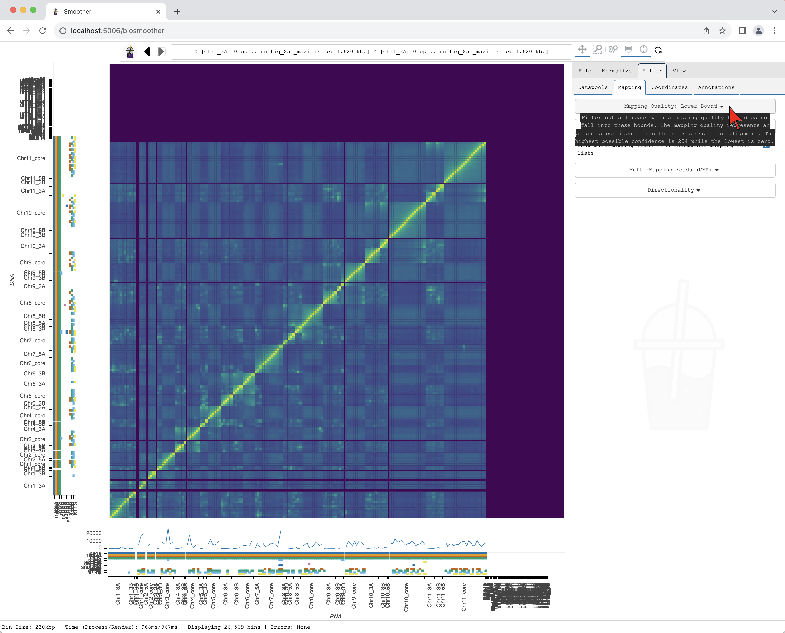
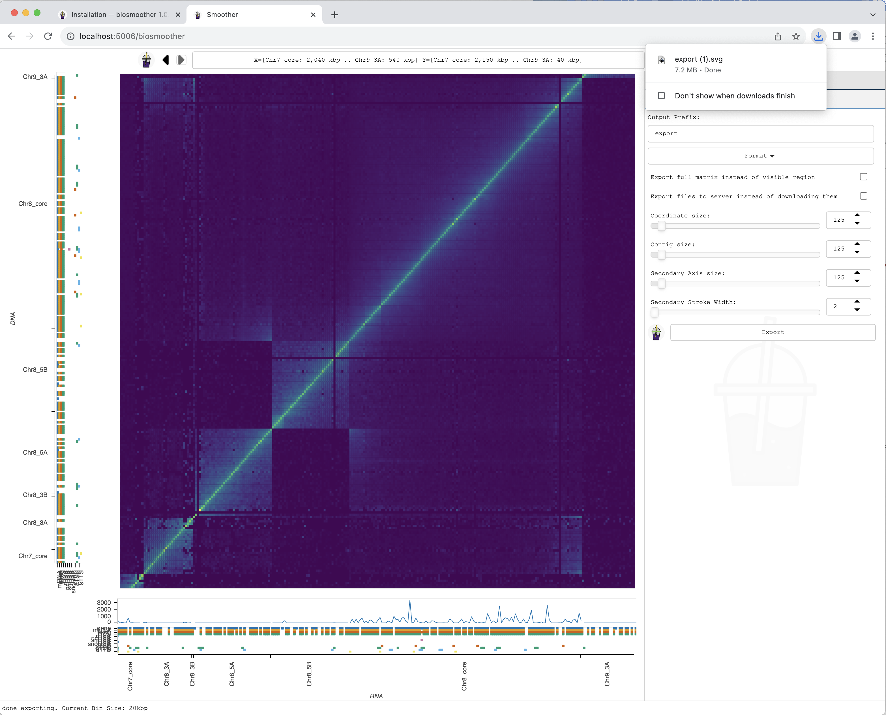
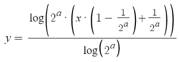

.. index: Tour
.. _tour_target:

# Taking a tour

In this example, we install Smoother, download one of the sample datasets and run basic analyses. To do that we should have a terminal open:


We start by installing Smoother. Firstly, we create a new environment.

<div class="highlight-default notranslate">
<div class="highlight">
<pre style="padding-bottom: 0px">
conda create -y -n smoother python=3.9
<details>
<summary style="color:grey">See the output of this command by clicking here.</summary>
<div>
    Collecting package metadata (current_repodata.json): done
    Solving environment: done


    ==> WARNING: A newer version of conda exists. <==
    current version: 4.10.3
    latest version: 23.9.0

    Please update conda by running

        $ conda update -n base conda


    ## Package Plan ##

    environment location: /home/abarcons/miniconda3/envs/smoother

    added / updated specs:
        - python=3.9


    The following packages will be downloaded:

        package                    |            build
        ---------------------------|-----------------
        libnsl-2.0.0               |       hd590300_1          32 KB  conda-forge
        libsqlite-3.43.2           |       h2797004_0         820 KB  conda-forge
        tk-8.6.13                  |       h2797004_0         3.1 MB  conda-forge
        ------------------------------------------------------------
                                            Total:         4.0 MB

    The following NEW packages will be INSTALLED:

    _libgcc_mutex      conda-forge/linux-64::_libgcc_mutex-0.1-conda_forge
    _openmp_mutex      conda-forge/linux-64::_openmp_mutex-4.5-2_gnu
    bzip2              conda-forge/linux-64::bzip2-1.0.8-h7f98852_4
    ca-certificates    conda-forge/linux-64::ca-certificates-2023.7.22-hbcca054_0
    ld_impl_linux-64   conda-forge/linux-64::ld_impl_linux-64-2.40-h41732ed_0
    libffi             conda-forge/linux-64::libffi-3.4.2-h7f98852_5
    libgcc-ng          conda-forge/linux-64::libgcc-ng-13.2.0-h807b86a_2
    libgomp            conda-forge/linux-64::libgomp-13.2.0-h807b86a_2
    libnsl             conda-forge/linux-64::libnsl-2.0.0-hd590300_1
    libsqlite          conda-forge/linux-64::libsqlite-3.43.2-h2797004_0
    libuuid            conda-forge/linux-64::libuuid-2.38.1-h0b41bf4_0
    libzlib            conda-forge/linux-64::libzlib-1.2.13-hd590300_5
    ncurses            conda-forge/linux-64::ncurses-6.4-hcb278e6_0
    openssl            conda-forge/linux-64::openssl-3.1.3-hd590300_0
    pip                conda-forge/noarch::pip-23.2.1-pyhd8ed1ab_0
    python             conda-forge/linux-64::python-3.9.18-h0755675_0_cpython
    readline           conda-forge/linux-64::readline-8.2-h8228510_1
    setuptools         conda-forge/noarch::setuptools-68.2.2-pyhd8ed1ab_0
    tk                 conda-forge/linux-64::tk-8.6.13-h2797004_0
    tzdata             conda-forge/noarch::tzdata-2023c-h71feb2d_0
    wheel              conda-forge/noarch::wheel-0.41.2-pyhd8ed1ab_0
    xz                 conda-forge/linux-64::xz-5.2.6-h166bdaf_0


    Downloading and Extracting Packages
    libsqlite-3.43.2     | 820 KB    | ######################################################## | 100% 
    libnsl-2.0.0         | 32 KB     | ######################################################## | 100% 
    tk-8.6.13            | 3.1 MB    | ######################################################## | 100% 
    Preparing transaction: done
    Verifying transaction: done
    Executing transaction: done
    #
    # To activate this environment, use
    #
    #     $ conda activate smoother
    #
    # To deactivate an active environment, use
    #
    #     $ conda deactivate
</div>
</details>
</pre>
</div>
</div>


Secondly, we activate the environment.


    conda activate smoother


Then, we install Smoother.


<div class="highlight-default notranslate">
<div class="highlight">
<pre style="padding-bottom: 0px">
pip install biosmoother
<details>
<summary style="color:grey">See the output of this command by clicking here.</summary>
<div>
    (smoother) [ID@master name]$ pip install biosmoother
    Collecting biosmoother
    Obtaining dependency information for biosmoother from https://files.pythonhosted.org/packages/bd/a4/641ba3c9ab5704b8c7f52484d57cd7a83a363202aa7f0e383f7e06d31a73/biosmoother-1.0.1-py3-none-any.whl.metadata
    Downloading biosmoother-1.0.1-py3-none-any.whl.metadata (1.2 kB)
    Collecting libbiosmoother (from biosmoother)
    Obtaining dependency information for libbiosmoother from https://files.pythonhosted.org/packages/12/2e/2f40405174cb7a567a95f07e0dbcf7dfcc0d30aa614f60e0e33302cd8f1f/libbiosmoother-1.0.2-cp39-cp39-manylinux_2_17_x86_64.manylinux2014_x86_64.whl.metadata
    Downloading libbiosmoother-1.0.2-cp39-cp39-manylinux_2_17_x86_64.manylinux2014_x86_64.whl.metadata (1.2 kB)
    Collecting bokeh==2.3.2 (from biosmoother)
    Using cached bokeh-2.3.2-py3-none-any.whl
    Collecting psutil (from biosmoother)
    Using cached psutil-5.9.5-cp36-abi3-manylinux_2_12_x86_64.manylinux2010_x86_64.manylinux_2_17_x86_64.manylinux2014_x86_64.whl (282 kB)
    Collecting pybase64 (from biosmoother)
    Obtaining dependency information for pybase64 from https://files.pythonhosted.org/packages/c0/9c/47876c6af2bbcc5d7d376f6fb04e46536d8fabe22d5633888d303d50ce20/pybase64-1.3.1-cp39-cp39-manylinux_2_5_x86_64.manylinux1_x86_64.manylinux_2_17_x86_64.manylinux2014_x86_64.whl.metadata
    Downloading pybase64-1.3.1-cp39-cp39-manylinux_2_5_x86_64.manylinux1_x86_64.manylinux_2_17_x86_64.manylinux2014_x86_64.whl.metadata (7.9 kB)
    Collecting PyYAML>=3.10 (from bokeh==2.3.2->biosmoother)
    Obtaining dependency information for PyYAML>=3.10 from https://files.pythonhosted.org/packages/7d/39/472f2554a0f1e825bd7c5afc11c817cd7a2f3657460f7159f691fbb37c51/PyYAML-6.0.1-cp39-cp39-manylinux_2_17_x86_64.manylinux2014_x86_64.whl.metadata
    Using cached PyYAML-6.0.1-cp39-cp39-manylinux_2_17_x86_64.manylinux2014_x86_64.whl.metadata (2.1 kB)
    Collecting python-dateutil>=2.1 (from bokeh==2.3.2->biosmoother)
    Using cached python_dateutil-2.8.2-py2.py3-none-any.whl (247 kB)
    Collecting Jinja2>=2.9 (from bokeh==2.3.2->biosmoother)
    Using cached Jinja2-3.1.2-py3-none-any.whl (133 kB)
    Collecting numpy>=1.11.3 (from bokeh==2.3.2->biosmoother)
    Obtaining dependency information for numpy>=1.11.3 from https://files.pythonhosted.org/packages/75/cd/7ae0f2cd3fc68aea6cfb2b7e523842e1fa953adb38efabc110d27ba6e423/numpy-1.26.0-cp39-cp39-manylinux_2_17_x86_64.manylinux2014_x86_64.whl.metadata
    Using cached numpy-1.26.0-cp39-cp39-manylinux_2_17_x86_64.manylinux2014_x86_64.whl.metadata (58 kB)
    Collecting pillow>=7.1.0 (from bokeh==2.3.2->biosmoother)
    Obtaining dependency information for pillow>=7.1.0 from https://files.pythonhosted.org/packages/5d/cc/3345b8cf6f2b8c5ee33d59e3e2ddb693c45c4f3c88e10859f8b8abf9dc82/Pillow-10.0.1-cp39-cp39-manylinux_2_17_x86_64.manylinux2014_x86_64.whl.metadata
    Using cached Pillow-10.0.1-cp39-cp39-manylinux_2_17_x86_64.manylinux2014_x86_64.whl.metadata (9.5 kB)
    Collecting packaging>=16.8 (from bokeh==2.3.2->biosmoother)
    Obtaining dependency information for packaging>=16.8 from https://files.pythonhosted.org/packages/ec/1a/610693ac4ee14fcdf2d9bf3c493370e4f2ef7ae2e19217d7a237ff42367d/packaging-23.2-py3-none-any.whl.metadata
    Downloading packaging-23.2-py3-none-any.whl.metadata (3.2 kB)
    Collecting tornado>=5.1 (from bokeh==2.3.2->biosmoother)
    Obtaining dependency information for tornado>=5.1 from https://files.pythonhosted.org/packages/66/a5/e6da56c03ff61200d5a43cfb75ab09316fc0836aa7ee26b4e9dcbfc3ae85/tornado-6.3.3-cp38-abi3-manylinux_2_5_x86_64.manylinux1_x86_64.manylinux_2_17_x86_64.manylinux2014_x86_64.whl.metadata
    Using cached tornado-6.3.3-cp38-abi3-manylinux_2_5_x86_64.manylinux1_x86_64.manylinux_2_17_x86_64.manylinux2014_x86_64.whl.metadata (2.5 kB)
    Collecting typing-extensions>=3.7.4 (from bokeh==2.3.2->biosmoother)
    Obtaining dependency information for typing-extensions>=3.7.4 from https://files.pythonhosted.org/packages/24/21/7d397a4b7934ff4028987914ac1044d3b7d52712f30e2ac7a2ae5bc86dd0/typing_extensions-4.8.0-py3-none-any.whl.metadata
    Using cached typing_extensions-4.8.0-py3-none-any.whl.metadata (3.0 kB)
    Collecting scipy (from libbiosmoother->biosmoother)
    Obtaining dependency information for scipy from https://files.pythonhosted.org/packages/88/8c/9d1f74196c296046af1f20e6d3fc7fbb27387282315e1643f450bba14329/scipy-1.11.3-cp39-cp39-manylinux_2_17_x86_64.manylinux2014_x86_64.whl.metadata
    Downloading scipy-1.11.3-cp39-cp39-manylinux_2_17_x86_64.manylinux2014_x86_64.whl.metadata (60 kB)
        ━━━━━━━━━━━━━━━━━━━━━━━━━━━━━━━━━━━━━━━━ 60.4/60.4 kB 1.3 MB/s eta 0:00:00
    Collecting statsmodels (from libbiosmoother->biosmoother)
    Using cached statsmodels-0.14.0-cp39-cp39-manylinux_2_17_x86_64.manylinux2014_x86_64.whl (10.1 MB)
    Collecting scikit-learn (from libbiosmoother->biosmoother)
    Obtaining dependency information for scikit-learn from https://files.pythonhosted.org/packages/af/ad/329a88013936e4372181c0e275c19aa6130b0835876726944b811af5a856/scikit_learn-1.3.1-cp39-cp39-manylinux_2_17_x86_64.manylinux2014_x86_64.whl.metadata
    Using cached scikit_learn-1.3.1-cp39-cp39-manylinux_2_17_x86_64.manylinux2014_x86_64.whl.metadata (11 kB)
    Collecting drawSvg==1.9.0 (from libbiosmoother->biosmoother)
    Using cached drawSvg-1.9.0-py3-none-any.whl (26 kB)
    Collecting cairoSVG (from drawSvg==1.9.0->libbiosmoother->biosmoother)
    Obtaining dependency information for cairoSVG from https://files.pythonhosted.org/packages/01/a5/1866b42151f50453f1a0d28fc4c39f5be5f412a2e914f33449c42daafdf1/CairoSVG-2.7.1-py3-none-any.whl.metadata
    Using cached CairoSVG-2.7.1-py3-none-any.whl.metadata (2.7 kB)
    Collecting imageio (from drawSvg==1.9.0->libbiosmoother->biosmoother)
    Obtaining dependency information for imageio from https://files.pythonhosted.org/packages/f6/37/e21e6f38b93878ba80302e95b8ccd4718d80f0c53055ccae343e606b1e2d/imageio-2.31.5-py3-none-any.whl.metadata
    Downloading imageio-2.31.5-py3-none-any.whl.metadata (4.6 kB)
    Collecting MarkupSafe>=2.0 (from Jinja2>=2.9->bokeh==2.3.2->biosmoother)
    Obtaining dependency information for MarkupSafe>=2.0 from https://files.pythonhosted.org/packages/de/63/cb7e71984e9159ec5f45b5e81e896c8bdd0e45fe3fc6ce02ab497f0d790e/MarkupSafe-2.1.3-cp39-cp39-manylinux_2_17_x86_64.manylinux2014_x86_64.whl.metadata
    Using cached MarkupSafe-2.1.3-cp39-cp39-manylinux_2_17_x86_64.manylinux2014_x86_64.whl.metadata (3.0 kB)
    Collecting six>=1.5 (from python-dateutil>=2.1->bokeh==2.3.2->biosmoother)
    Using cached six-1.16.0-py2.py3-none-any.whl (11 kB)
    Collecting joblib>=1.1.1 (from scikit-learn->libbiosmoother->biosmoother)
    Obtaining dependency information for joblib>=1.1.1 from https://files.pythonhosted.org/packages/10/40/d551139c85db202f1f384ba8bcf96aca2f329440a844f924c8a0040b6d02/joblib-1.3.2-py3-none-any.whl.metadata
    Using cached joblib-1.3.2-py3-none-any.whl.metadata (5.4 kB)
    Collecting threadpoolctl>=2.0.0 (from scikit-learn->libbiosmoother->biosmoother)
    Obtaining dependency information for threadpoolctl>=2.0.0 from https://files.pythonhosted.org/packages/81/12/fd4dea011af9d69e1cad05c75f3f7202cdcbeac9b712eea58ca779a72865/threadpoolctl-3.2.0-py3-none-any.whl.metadata
    Using cached threadpoolctl-3.2.0-py3-none-any.whl.metadata (10.0 kB)
    Collecting pandas>=1.0 (from statsmodels->libbiosmoother->biosmoother)
    Obtaining dependency information for pandas>=1.0 from https://files.pythonhosted.org/packages/bc/7e/a9e11bd272e3135108892b6230a115568f477864276181eada3a35d03237/pandas-2.1.1-cp39-cp39-manylinux_2_17_x86_64.manylinux2014_x86_64.whl.metadata
    Using cached pandas-2.1.1-cp39-cp39-manylinux_2_17_x86_64.manylinux2014_x86_64.whl.metadata (18 kB)
    Collecting patsy>=0.5.2 (from statsmodels->libbiosmoother->biosmoother)
    Using cached patsy-0.5.3-py2.py3-none-any.whl (233 kB)
    Collecting pytz>=2020.1 (from pandas>=1.0->statsmodels->libbiosmoother->biosmoother)
    Obtaining dependency information for pytz>=2020.1 from https://files.pythonhosted.org/packages/32/4d/aaf7eff5deb402fd9a24a1449a8119f00d74ae9c2efa79f8ef9994261fc2/pytz-2023.3.post1-py2.py3-none-any.whl.metadata
    Using cached pytz-2023.3.post1-py2.py3-none-any.whl.metadata (22 kB)
    Collecting tzdata>=2022.1 (from pandas>=1.0->statsmodels->libbiosmoother->biosmoother)
    Using cached tzdata-2023.3-py2.py3-none-any.whl (341 kB)
    Collecting cairocffi (from cairoSVG->drawSvg==1.9.0->libbiosmoother->biosmoother)
    Obtaining dependency information for cairocffi from https://files.pythonhosted.org/packages/17/be/a5d2c16317c6a890502725970589ae7f06cfc66b2e6916ba0a86973403c8/cairocffi-1.6.1-py3-none-any.whl.metadata
    Using cached cairocffi-1.6.1-py3-none-any.whl.metadata (3.3 kB)
    Collecting cssselect2 (from cairoSVG->drawSvg==1.9.0->libbiosmoother->biosmoother)
    Using cached cssselect2-0.7.0-py3-none-any.whl (15 kB)
    Collecting defusedxml (from cairoSVG->drawSvg==1.9.0->libbiosmoother->biosmoother)
    Using cached defusedxml-0.7.1-py2.py3-none-any.whl (25 kB)
    Collecting tinycss2 (from cairoSVG->drawSvg==1.9.0->libbiosmoother->biosmoother)
    Using cached tinycss2-1.2.1-py3-none-any.whl (21 kB)
    Collecting cffi>=1.1.0 (from cairocffi->cairoSVG->drawSvg==1.9.0->libbiosmoother->biosmoother)
    Obtaining dependency information for cffi>=1.1.0 from https://files.pythonhosted.org/packages/ea/ac/e9e77bc385729035143e54cc8c4785bd480eaca9df17565963556b0b7a93/cffi-1.16.0-cp39-cp39-manylinux_2_17_x86_64.manylinux2014_x86_64.whl.metadata
    Downloading cffi-1.16.0-cp39-cp39-manylinux_2_17_x86_64.manylinux2014_x86_64.whl.metadata (1.5 kB)
    Collecting webencodings (from cssselect2->cairoSVG->drawSvg==1.9.0->libbiosmoother->biosmoother)
    Using cached webencodings-0.5.1-py2.py3-none-any.whl (11 kB)
    Collecting pycparser (from cffi>=1.1.0->cairocffi->cairoSVG->drawSvg==1.9.0->libbiosmoother->biosmoother)
    Using cached pycparser-2.21-py2.py3-none-any.whl (118 kB)
    Downloading biosmoother-1.0.1-py3-none-any.whl (339 kB)
    ━━━━━━━━━━━━━━━━━━━━━━━━━━━━━━━━━━━━━━━━ 339.4/339.4 kB 6.9 MB/s eta 0:00:00
    Downloading libbiosmoother-1.0.2-cp39-cp39-manylinux_2_17_x86_64.manylinux2014_x86_64.whl (1.6 MB)
    ━━━━━━━━━━━━━━━━━━━━━━━━━━━━━━━━━━━━━━━━ 1.6/1.6 MB 4.4 MB/s eta 0:00:00
    Downloading pybase64-1.3.1-cp39-cp39-manylinux_2_5_x86_64.manylinux1_x86_64.manylinux_2_17_x86_64.manylinux2014_x86_64.whl (64 kB)
    ━━━━━━━━━━━━━━━━━━━━━━━━━━━━━━━━━━━━━━━━ 64.9/64.9 kB 11.4 MB/s eta 0:00:00
    Using cached numpy-1.26.0-cp39-cp39-manylinux_2_17_x86_64.manylinux2014_x86_64.whl (18.2 MB)
    Downloading packaging-23.2-py3-none-any.whl (53 kB)
    ━━━━━━━━━━━━━━━━━━━━━━━━━━━━━━━━━━━━━━━━ 53.0/53.0 kB 10.4 MB/s eta 0:00:00
    Using cached Pillow-10.0.1-cp39-cp39-manylinux_2_17_x86_64.manylinux2014_x86_64.whl (3.5 MB)
    Using cached PyYAML-6.0.1-cp39-cp39-manylinux_2_17_x86_64.manylinux2014_x86_64.whl (738 kB)
    Using cached tornado-6.3.3-cp38-abi3-manylinux_2_5_x86_64.manylinux1_x86_64.manylinux_2_17_x86_64.manylinux2014_x86_64.whl (427 kB)
    Using cached typing_extensions-4.8.0-py3-none-any.whl (31 kB)
    Using cached scikit_learn-1.3.1-cp39-cp39-manylinux_2_17_x86_64.manylinux2014_x86_64.whl (10.9 MB)
    Downloading scipy-1.11.3-cp39-cp39-manylinux_2_17_x86_64.manylinux2014_x86_64.whl (36.6 MB)
    ━━━━━━━━━━━━━━━━━━━━━━━━━━━━━━━━━━━━━━━━ 36.6/36.6 MB 10.8 MB/s eta 0:00:00
    Using cached joblib-1.3.2-py3-none-any.whl (302 kB)
    Using cached MarkupSafe-2.1.3-cp39-cp39-manylinux_2_17_x86_64.manylinux2014_x86_64.whl (25 kB)
    Using cached pandas-2.1.1-cp39-cp39-manylinux_2_17_x86_64.manylinux2014_x86_64.whl (12.3 MB)
    Using cached threadpoolctl-3.2.0-py3-none-any.whl (15 kB)
    Using cached CairoSVG-2.7.1-py3-none-any.whl (43 kB)
    Downloading imageio-2.31.5-py3-none-any.whl (313 kB)
    ━━━━━━━━━━━━━━━━━━━━━━━━━━━━━━━━━━━━━━━━ 313.2/313.2 kB 10.8 MB/s eta 0:00:00
    Using cached pytz-2023.3.post1-py2.py3-none-any.whl (502 kB)
    Using cached cairocffi-1.6.1-py3-none-any.whl (75 kB)
    Downloading cffi-1.16.0-cp39-cp39-manylinux_2_17_x86_64.manylinux2014_x86_64.whl (443 kB)
    ━━━━━━━━━━━━━━━━━━━━━━━━━━━━━━━━━━━━━━━━ 443.4/443.4 kB 39.7 MB/s eta 0:00:00
    Installing collected packages: webencodings, pytz, tzdata, typing-extensions, tornado, tinycss2, threadpoolctl, six, PyYAML, pycparser, pybase64, psutil, pillow, packaging, numpy, MarkupSafe, joblib, defusedxml, scipy, python-dateutil, patsy, Jinja2, imageio, cssselect2, cffi, scikit-learn, pandas, cairocffi, bokeh, statsmodels, cairoSVG, drawSvg, libbiosmoother, biosmoother
    Successfully installed Jinja2-3.1.2 MarkupSafe-2.1.3 PyYAML-6.0.1 biosmoother-1.0.1 bokeh-2.3.2 cairoSVG-2.7.1 cairocffi-1.6.1 cffi-1.16.0 cssselect2-0.7.0 defusedxml-0.7.1 drawSvg-1.9.0 imageio-2.31.5 joblib-1.3.2 libbiosmoother-1.0.2 numpy-1.26.0 packaging-23.2 pandas-2.1.1 patsy-0.5.3 pillow-10.0.1 psutil-5.9.5 pybase64-1.3.1 pycparser-2.21 python-dateutil-2.8.2 pytz-2023.3.post1 scikit-learn-1.3.1 scipy-1.11.3 six-1.16.0 statsmodels-0.14.0 threadpoolctl-3.2.0 tinycss2-1.2.1 tornado-6.3.3 typing-extensions-4.8.0 tzdata-2023.3 webencodings-0.5.1
</div>
</details>
</pre>
</div>
</div>

Finally, we install further requirements for Smoother.

<div class="highlight-default notranslate">
<div class="highlight">
<pre style="padding-bottom: 0px">
conda install -y nodejs cairo
<details>
<summary style="color:grey">See the output of this command by clicking here.</summary>
<div>

    Collecting package metadata (current_repodata.json): done
    Solving environment: done


    ==> WARNING: A newer version of conda exists. <==
    current version: 4.10.3
    latest version: 23.9.0

    Please update conda by running

        $ conda update -n base conda


    ## Package Plan ##

    environment location: /home/abarcons/miniconda3/envs/smoother

    added / updated specs:
        - cairo
        - nodejs


    The following packages will be downloaded:

        package                    |            build
        ---------------------------|-----------------
        cairo-1.16.0               |    h0c91306_1017         1.1 MB  conda-forge
        libxcb-1.15                |       h0b41bf4_0         375 KB  conda-forge
        nodejs-20.8.0              |       hb753e55_0        16.3 MB  conda-forge
        pixman-0.42.2              |       h59595ed_0         376 KB  conda-forge
        xorg-libx11-1.8.6          |       h8ee46fc_0         809 KB  conda-forge
        xorg-libxrender-0.9.11     |       hd590300_0          37 KB  conda-forge
        ------------------------------------------------------------
                                            Total:        18.9 MB

    The following NEW packages will be INSTALLED:

    cairo              conda-forge/linux-64::cairo-1.16.0-h0c91306_1017
    expat              conda-forge/linux-64::expat-2.5.0-hcb278e6_1
    font-ttf-dejavu-s~ conda-forge/noarch::font-ttf-dejavu-sans-mono-2.37-hab24e00_0
    font-ttf-inconsol~ conda-forge/noarch::font-ttf-inconsolata-3.000-h77eed37_0
    font-ttf-source-c~ conda-forge/noarch::font-ttf-source-code-pro-2.038-h77eed37_0
    font-ttf-ubuntu    conda-forge/noarch::font-ttf-ubuntu-0.83-hab24e00_0
    fontconfig         conda-forge/linux-64::fontconfig-2.14.2-h14ed4e7_0
    fonts-conda-ecosy~ conda-forge/noarch::fonts-conda-ecosystem-1-0
    fonts-conda-forge  conda-forge/noarch::fonts-conda-forge-1-0
    freetype           conda-forge/linux-64::freetype-2.12.1-h267a509_2
    gettext            conda-forge/linux-64::gettext-0.21.1-h27087fc_0
    icu                conda-forge/linux-64::icu-73.2-h59595ed_0
    libexpat           conda-forge/linux-64::libexpat-2.5.0-hcb278e6_1
    libglib            conda-forge/linux-64::libglib-2.78.0-hebfc3b9_0
    libiconv           conda-forge/linux-64::libiconv-1.17-h166bdaf_0
    libpng             conda-forge/linux-64::libpng-1.6.39-h753d276_0
    libstdcxx-ng       conda-forge/linux-64::libstdcxx-ng-13.2.0-h7e041cc_2
    libuv              conda-forge/linux-64::libuv-1.46.0-hd590300_0
    libxcb             conda-forge/linux-64::libxcb-1.15-h0b41bf4_0
    nodejs             conda-forge/linux-64::nodejs-20.8.0-hb753e55_0
    pcre2              conda-forge/linux-64::pcre2-10.40-hc3806b6_0
    pixman             conda-forge/linux-64::pixman-0.42.2-h59595ed_0
    pthread-stubs      conda-forge/linux-64::pthread-stubs-0.4-h36c2ea0_1001
    xorg-kbproto       conda-forge/linux-64::xorg-kbproto-1.0.7-h7f98852_1002
    xorg-libice        conda-forge/linux-64::xorg-libice-1.1.1-hd590300_0
    xorg-libsm         conda-forge/linux-64::xorg-libsm-1.2.4-h7391055_0
    xorg-libx11        conda-forge/linux-64::xorg-libx11-1.8.6-h8ee46fc_0
    xorg-libxau        conda-forge/linux-64::xorg-libxau-1.0.11-hd590300_0
    xorg-libxdmcp      conda-forge/linux-64::xorg-libxdmcp-1.1.3-h7f98852_0
    xorg-libxext       conda-forge/linux-64::xorg-libxext-1.3.4-h0b41bf4_2
    xorg-libxrender    conda-forge/linux-64::xorg-libxrender-0.9.11-hd590300_0
    xorg-renderproto   conda-forge/linux-64::xorg-renderproto-0.11.1-h7f98852_1002
    xorg-xextproto     conda-forge/linux-64::xorg-xextproto-7.3.0-h0b41bf4_1003
    xorg-xproto        conda-forge/linux-64::xorg-xproto-7.0.31-h7f98852_1007
    zlib               conda-forge/linux-64::zlib-1.2.13-hd590300_5


    Downloading and Extracting Packages
    libxcb-1.15          | 375 KB    | ############################################ | 100% 
    cairo-1.16.0         | 1.1 MB    | ############################################ | 100% 
    nodejs-20.8.0        | 16.3 MB   | ############################################ | 100% 
    pixman-0.42.2        | 376 KB    | ############################################ | 100% 
    xorg-libx11-1.8.6    | 809 KB    | ############################################ | 100% 
    xorg-libxrender-0.9. | 37 KB     | ############################################ | 100% 
    Preparing transaction: done
    Verifying transaction: done
    Executing transaction: done
</div>
</details>
</pre>
</div>
</div>

We download one example Smoother index.


<div class="highlight-default notranslate">
<div class="highlight">
<pre style="padding-bottom: 0px">
wget https://syncandshare.lrz.de/dl/fi7p5SyG4uq9hzTiuEh8TK/t_brucei_hi_c.smoother_index.zip
<details>
<summary style="color:grey">See the output of this command by clicking here.</summary>
<div>
    --2023-10-11 14:20:52--  https://syncandshare.lrz.de/dl/fi7p5SyG4uq9hzTiuEh8TK/t_brucei_hi_c.smoother_index.zip
    Resolving syncandshare.lrz.de (syncandshare.lrz.de)... 129.187.255.213
    Connecting to syncandshare.lrz.de (syncandshare.lrz.de)|129.187.255.213|:443... connected.
    HTTP request sent, awaiting response... 200 OK
    Length: 1297169622 (1.2G) [application/x-zip-compressed]
    Saving to: 't_brucei_hi_c.smoother_index.zip'

    100%[===============================================================================================>] 1,297,169,622 58.2MB/s   in 20s    

    2023-10-11 14:21:13 (60.6 MB/s) - 't_brucei_hi_c.smoother_index.zip' saved [1297169622/1297169622]
</div>
</details>
</pre>
</div>
</div>


We unzip the example Smoother index.

<div class="highlight-default notranslate">
<div class="highlight">
<pre style="padding-bottom: 0px">
unzip t_brucei_hi_c.smoother_index.zip
<details>
<summary style="color:grey">See the output of this command by clicking here.</summary>
<div>
    Archive:  t_brucei_hi_c.smoother_index.zip
    creating: t_brucei_hi_c.smoother_index/
    extracting: t_brucei_hi_c.smoother_index/sps.corners  
    inflating: t_brucei_hi_c.smoother_index/anno.desc  
    inflating: t_brucei_hi_c.smoother_index/anno.intervals  
    inflating: t_brucei_hi_c.smoother_index/session.json  
    inflating: t_brucei_hi_c.smoother_index/default_session.json  
    inflating: t_brucei_hi_c.smoother_index/sps.overlays  
    inflating: t_brucei_hi_c.smoother_index/sps.coords  
    inflating: t_brucei_hi_c.smoother_index/anno.datasets  
    inflating: t_brucei_hi_c.smoother_index/sps.prefix_sums  
    inflating: t_brucei_hi_c.smoother_index/sps.datasets  
</div>
</details>
</pre>
</div>
</div>


We load the index on Smoother.

<div class="highlight-default notranslate">
<div class="highlight">
<pre style="padding-bottom: 0px">
biosmoother serve t_brucei_hi_c.smoother_index --show
<details>
<summary style="color:grey">See the output of this command by clicking here.</summary>
<div>
    loading index...
    done loading.
    starting biosmoother server at: http://localhost:5006/biosmoother
    WARNING: the version of libSps that was used to create this index is different from the current version. This may lead to undefined behavior.
    Version in index: 0.4.1-ca0d905-2023-09-05-14:22:50 
    Current version: 1.0.0-5c093ba-2023-10-10-12:35:53
    WARNING: the version of libBioSmoother that was used to create this index is different from the current version. This may lead to undefined behavior.
    Version in index: 0.5.0-ce0be2e-2023-09-11-12:53:38 
    Current version: 1.0.3-8512484-2023-10-11-17:36:56
</div>
</details>
</pre>
</div>
</div>


Since we used the `--show` option, a browser tab should open. In it we should see our heatmap after a few seconds:


## Changing mapping quality filter

We will now perform some example analysis and navigation on Smoother.

We start by changing the mapping quality filter. First, we select the :kbd:`Filter` tab.


We then select the :kbd:`Filter->Mapping` subtab.


In the dropdown menu :guilabel:`Mapping Quality: Lower Bound` we can select the threshold for mapping quality.



Here, we select >=30 that will filter out the reads with mapping quality score below 30.


After selecting the filter, the heatmap re-renders with the updated mapping quality filter.


## Zooming into a region of interest

We now can zoom to a particular genomic location of interest, for example using the :guilabel:`Box zoom`.


We draw a box around the region of interest.


Smoother renders the zoomed region. While Smoother is rendering there is a yellow background on the top left icon.


The new region is rendered.


## Exporting a picture
We can now export a picture of the zoomed in region of interest. To do so we have to select the :kbd:`File->Export` subtab.


We then select the format we want in the dropdown menu :guilabel:`Format`.


We can then press the :guilabel:`Export` button to save the file.


The picture file is saved.




.. _installation_target:

# Installation

.. index:: pip, installation

## Pip

The easiest way to install Smoother is via pip and conda

    pip install biosmoother
    conda install -y nodejs cairo

This will install `biosmoother`, the graphical user interface, and `libbiosmoother`, the backend behind the GUI and the command-line interface.

.. index:: compiling

## Compiling Smoother yourself

For installing Smoother via GitHub, run the following commands:

    # clone repository
    git clone https://github.com/Siegel-Lab/BioSmoother.git

    # create the required conda environment
    ./conda_env/create_smoother_env.sh

    # install using pip
    pip install -e .

While the pip installation will install the latest stable release, this type of installation will install the newest, possibly untested version. Note that this approach does still use pip to install the latest stable release of libBioSmoother and libSps, the two backend libraries behind Smoother. To also install these two libraries on your own, you will have to clone the respective repositories and install manually from them using the `pip install -e .` command. Then you can install Smoother using `pip install -e . –no-deps` to install Smoother without adjustments to the dependencies.

.. index:: help, subcommands
.. _command_organization_target:

# Command organization

Smoother has multiple subcommands, all of which interact with an index directory. An index contains the genome, its annotations, as well as the datasets to be analyzed and visualized. Each of the subcommands is designed to perform one specific task on the index. For example, there are the `init` and `serve` subcommands that can be called as follows:

    biosmoother init ...
    biosmoother serve ...

To see the main help page, run:

    biosmoother -h

To see the help pages of the individual subcommands (e.g., for `init`), run:

    biosmoother init -h

A complete list of subcommands can be found :ref:`here <cli_target>`. The following chapters explain how to use the subcommands for creating and interacting with indices.

.. _creating_an_index_target:

# Creating an index
All data to be analyzed and visualized on Smoother needs to be precomputed into an index. In the next chapters, we will explain how to initialize an index and fill it with data.

.. index:: init, gff, annotation, .sizes

## Initializing an index

Before an index can be filled with interactome data, we must set it up for a given reference genome. Generating an empty index is done using the `init` subcommand. The command outputs an index directory.

Let us create a new index for the Trypanosoma brucei genome.

If we have a .gff file, containing annotations for our genome, we must include this file right when creating the index:

    biosmoother init my_index -a tryp_anno.gff
    
This command will create a folder called `my_index.smoother_index`. In all other subcommands, we can now use `my_index` to refer to this index. The `tryp_anno.gff` file must match the [GFF specifications](http://gmod.org/wiki/GFF3), and looks something like this:

    ##sequence-region Chr1 253215
    ##sequence-region Chr2 546247
    Chr1   EuPathDB   gene   33710   34309   .   -   .   ID=Tb427_010006200.1;description=hypothetical protein / conserved
    Chr2   EuPathDB   rRNA   1582219 1583848 .   -   .   ID=Tb427_000074200:rRNA;description=unspecified product

If, for some reason, we do not have a .gff file, we can also create an index without annotations However, then we need to supply a file containing the contig sizes of the genome:

    biosmoother init my_index -c tryp.sizes

`tryp.sizes` is the file that contains the contig sizes of the genome. It looks something like this:

    #contig_name contig_size
    chr1 844108
    chr2 882890


.. Important::
    Currently, we recommend Smoother only for genomes < 150Mbp in size, as indices might become very large (many hundreds of gigabytes) otherwise. The easiest way to reduce index size is to increase the base resolution of the index. For this, you can use the `-d` parameter of the `init` subcommand. The base resolution is the highest resolution that can be displayed, so do not set it lower than the resolutions you are interested in.

The full documentation of the `init` subcommand can be found :ref:`here <init_command>`.

.. index:: repl, pairs

## Adding replicates to an index

Adding data for a sample or replicate to an index is done with the `repl` subcommand. This requires an input pairs file containing the two-dimensional interactome matrix for the aligned reads. Preprocessing of the data and input pairs file generation are explained in detail in the next section.

The basic usage of the `repl` subcommand is as follows:

    biosmoother repl my_index replicate_data replicate_name

Here, `my_index` is the index the data shall be added to, `replicate_data` is a file containing the actual data, and `replicate_name` is the displayname of that dataset in the user interface.
There is a way to load gzipped (or similar) datafiles into Smoother using pipes:

    zcat replicate_data.gz | biosmoother repl my_index – replicate_name

The full documentation of the `repl` subcommand can be found :ref:`here <repl_command>`.

### Input format for the repl command
Smoother requires a whitespace (space or tab) delimited input pairs file containing the two-dimensional interactions. Each input pairs file contains the data for one sample or replicate to be analyzed and visualized. Each line in the file has the information for one interaction.

The default format for the input pairs file is compatible with the output from pairtools and corresponds to the following `-C` option for the `repl` subcommand: `-C [readID] chr1 pos1 chr2 pos2 [strand1] [strand2] [.] [mapq1] [mapq2] [xa1] [xa2] [cnt]`. Such a file would, for example, look something like this:

    SRR7721318.88322997     chr1  284     chr1  4765    -       +       UU      0       0
    SRR7721318.659929       chr1  294     chr1  366     +       -       UU      29      29      chr5,-1363,3S73M,2;chr11,+1132,73M3S,2;  chr6,-1131,2S74M,2;
    # ...

Smoother also supports input files formatted as count matrices. A count matrix would look something like this:

    chr1    1    chr1      1    123
    chr1    1    chr1  10000     57

For this, please use the `-C` option `chr1 pos1 chr2 pos2 cnt`. However, it is important to note that the limited information in such files won't allow Smoother to perform analyses at its full potential. Indeed, count matrices are already binned and thus the 'pos' columns correspond to the bin position. Hence, setting a smaller base resolution (with the `-d` option in the `init` subcommand) or using annotation filtering will not provide useful information and should be avoided, since the individual positions of reads have been lost by using a count matrix file. The functionalities of Smoother will be limited: 1) filtering by annotation will only be able to consider the bin locations instead of the actual read locations; 2) similarly, the base resolution of the heatmap will be limited by the bin size of the count matrix. For example, if the input pairs file has a bin size of 10 kbp, the heatmap will not be able to display a resolution higher than 10 kbp.

See the table below for a summary of filtering functionalities of Smoother depending on the input file format used to generate the index:

<figure align=center>

<figcaption> <b>Figure:</b> Summary of filtering functionalities of Smoother depending on the input pairs file. <b>A</b>: column must exist; <b>X</b>: column cannot exist; <b>Y</b>: column exists; <b>N</b>: column does not exist; <b>On</b>: filter is active; <b>Off</b>: filter is inactive; <b>Off*</b>: filter can be active, but it is uninformative because position is binned</figcaption>
</figure>

The `-C` option accepts optional columns, indicated in squared brackets (e.g., with `-C [readID] chr1 pos1 chr2 pos2 [strand1] [strand2]`, readId, strand1 and strand2 are optional).
In this case, the input pairs file can contain rows with any of the following formats:

    readID chr1 pos1 chr2 pos2 strand1 strand2
    readID chr1 pos1 chr2 pos2 strand1
    readID chr1 pos1 chr2 pos2
    chr1 pos1 chr2 pos2

The following columns can be included in the input pairs file:
- `readID`: sequencing ID for the read or read name
- `chr`: chromosome (must be present in reference genome)
- `pos`: position in basepairs
- `strand`: DNA strand (+ or -)
- `.`: column to ignore
- `mapq`: mapping quality
- `xa`: XA tag from BWA with secondary alignments with format (chr,pos,CIGAR,NM;)
- `cnt`: read count frequency of row interaction.

.. Important::
    In the case of asymmetric data (like RNA-DNA interactome), 1 is the data displayed on the x-axis (columns) and 2 is the data displayed on the y-axis (rows). As default RNA is on the x-axis and DNA on the y-axis; however, this can be modified interactively after launching Smoother.

In the following subsections, we describe examples of the preprocessing workflow from raw demultiplexed fastq files to input pairs files for symmetric and asymmetric data sets.

### Preprocessing data for the repl command

#### Symmetric data sets, such as Hi-C or Micro-C
The following steps are one example that can be followed to produce the input pairs files necessary to generate the index for Smoother from raw Hi-C data.

The raw read files are mapped to the reference genome using bwa mem.

    bwa mem -t 8 -SP ${GENOME_NAME}.fna ${READ_FILE_1} ${READ_FILE_2}

Find ligation junctions and make pairs file using `pairtools parse` with the following options:
- `--drop-sam`: drop the sam information
- `--min-mapq 0`: do not filter by mapping quality
- `--add-columns mapq,XA`: add columns for mapping quality and alternative alignments
- `--walks-policy mask`: mask the walks (WW, XX, N*) in the pair_type column

```
    pairtools parse --drop-sam --min-mapq 0 --add-columns mapq,XA --walks-policy mask ${GENOME_NAME}.sizes
```

Filter out the walks (WW, XX, N*) from the pairs file using pairtools select

    pairtools select '(pair_type!="WW") and (pair_type!="XX") and not wildcard_match(pair_type, "N*")' {OUTPUT_PARSE}.pairs

Sort the output using pairtools sort

    pairtools sort --nproc 8 {OUTPUT_SELECT}.pairs

Deduplicate the output using pairtools dedup

    pairtools dedup {OUTPUT_SORT}.pairs

Generate the final pairs file that will be the input for generating Smoother index using pairtools split

    pairtools split {OUTPUT_DEDUP}.pairs --output-pairs ${SAMPLE_NAME}.pairs.gz

Below, an example of some lines of a Hi-C input pairs file that can be used to generate the Smoother index.

    ## pairs format v1.0.0
    #sorted: chr1-chr2-pos1-pos2
    #shape: upper triangle
    #genome_assembly: unknown
    #chromsize: BES10_Tb427v10 41824
    #chromsize: BES11_Tb427v10 66776
    #chromsize: BES12_Tb427v10 48283
    # ...
    #columns: readID chrom1 pos1 chrom2 pos2 strand1 strand2 pair_type mapq1 mapq2 XA1 XA2
    SRR7721318.37763890     BES10_Tb427v10  103     BES10_Tb427v10  4813    -       +       UU      0       0              
    SRR7721318.42386417     BES10_Tb427v10  184     BES10_Tb427v10  2446    +       -       UU      0       0              
    SRR7721318.659929       BES10_Tb427v10  294     BES10_Tb427v10  366     +       -       UU      29      29      unitig_172_Tb427v10,-1363,3S73M,2;BES12_Tb427v10,+1132,73M3S,2;BES12_Tb427v10,+1432,73M3S,2;unitig_172_Tb427v10,-1063,3S73M,2;  BES12_Tb427v10,-1131,2S74M,2;unitig_172_Tb427v10,+1063,74M2S,2;unitig_172_Tb427v10,+1363,74M2S,2;BES12_Tb427v10,-1431,2S74M,2;
    # ...

.. index:: RD-SPRITE, RADICL-seq

#### Asymmetric data sets, such as RD-SPRITE, or RADICL-seq

The following steps are one example that can be followed to produce the input pairs files necessary to generate the index for Smoother from single-read raw RADICL-seq [#radicl_seq]_ data.

First round of extraction of the RNA and DNA tags from the chimeric reads containing the RADICL adapter sequence using tagdust. Here read1 will be RNA and read2 will be DNA.

    tagdust -1 R:N -2 S:CTGCTGCTCCTTCCCTTTCCCCTTTTGGTCCGACGGTCCAAGTCAGCAGT -3 R:N -4 P:AGATCGGAAGAGCACACGTCTGAACTCCAGTCAC {READ_FILE} -t 38 -o {out1_R1D2}

Second round of extraction of the RNA and DNA tags from the chimeric reads containing the RADICL adapter sequence using tagdust. Here read1 will be DNA and read2 will be RNA.

    tagdust -1 R:N -2 S:ACTGCTGACTTGGACCGTCGGACCAAAAGGGGAAAGGGAAGGAGCAGCAG -3 R:N -4 P:AGATCGGAAGAGCACACGTCTGAACTCCAGTCAC {out1_R1D2} -t 38 -o {out2_D1R2}

Concatenate two files with RNA reads using fastx_toolkit.

    cat {out1_R1D2_READ1}.fq > {RNA}.fq
    cat {out2_D1R2_READ2}.fq | fastx_reverse_complement -Q33 >> {RNA}.fq

Concatenate two files with DNA reads using fastx_toolkit.

    cat {out1_R1D2_READ2}.fq | fastx_reverse_complement -Q33 >> {DNA}.fq
    cat {out2_D1R2_READ1}.fq > {DNA}.fq

The RNA and DNA read files are mapped to the reference genome using bwa aln with -N parameter to keep the multimapping reads.

    bwa aln -N ${GENOME_NAME}.fna {RNA}.fq > {RNA}.sai
    bwa aln -N ${GENOME_NAME}.fna {DNA}.fq > {DNA}.sai

Convert the output from the alignment to SAM format with a value for the -n parameter high enough to keep all interesting multimapping reads.

    bwa samse -n 60 ${GENOME_NAME}.fna {RNA}.sai {RNA}.fq > {RNA}.sam
    bwa samse -n 60 ${GENOME_NAME}.fna {DNA}.sai {DNA}.fq > {DNA}.sam

Generate tab-separated text files for RNA and for DNA with the information from the SAM files and adding dummy values (notag) if there is no XA tag.

    cat {RNA}.sam | awk -F '\t' 'BEGIN {OFS="\t";ORS=""} {if ($1 ~ !/^@/ && $3 ~ !/*/) {print $3,$4,$1,$5; for(i=12;i<=NF;i+=1) if ($i ~ /^XA:Z:/) print "",$i; print "\n"}}' | awk -F '\t' 'BEGIN {OFS="\t";ORS=""} {print $1,$2,$3,$4; if(NF<5) print "\tnotag"; else print "",$5; print "\n"}' >> {RNA}
    cat {DNA}.sam | awk -F '\t' 'BEGIN {OFS="\t";ORS=""} {if ($1 ~ !/^@/ && $3 ~ !/*/) {print $3,$4,$1,$5; for(i=12;i<=NF;i+=1) if ($i ~ /^XA:Z:/) print "",$i; print "\n"}}' | awk -F '\t' 'BEGIN {OFS="\t";ORS=""} {print $1,$2,$3,$4; if(NF<5) print "\tnotag"; else print "",$5; print "\n"}' >> {DNA}

Sort the RNA and DNA tab-separated text files.

    sort -k1,1 -k2,2n {RNA} > {RNA_k1k2}
    sort -k1,1 -k2,2n {DNA} > {DNA_k1k2}
    sort -k3,3 {RNA_k1k2} > {RNA_k3}
    sort -k3,3 {DNA_k1k2} > {DNA_k3}

Merge the RNA and DNA files based on the sequencing ID (column 3) to generate a single interactome file.

    join -j 3 {RNA_k3} {DNA_k3} | awk 'BEGIN{OFS="\t"}{print $2,$3,$1,$4,$5,$6,$7,$1,$8,$9}' > {R_D}

Below, an example of some lines of a RADICL-seq input pairs file that can be used to generate the Smoother index.

 
    SRR9201799.1 NC_000077.7 108902883 NC_000079.7 9361584 0 37 XA:Z:NC_000079.7,-97327088,27M,0;NC_000075.7,-3258605,27M,1;NC_000086.8,+13535333,27M,2; notag
    SRR9201799.10 NC_000075.7 46047334 NC_000075.7 45133248 0 37 notag notag
    SRR9201799.100 NC_000078.7 115363700 NC_000084.7 55062439 0 37 notag notag
    SRR9201799.1000 NC_000084.7 16977496 NC_000074.7 35058114 0 37 XA:Z:NC_000072.7,+128816081,26M,0;NC_000072.7,-128737045,26M,0;NC_000072.7,-128775829,26M,0;NC_000082.7,+32868030,26M,0;NC_000068.8,+27291980,26M,0; notag
    SRR9201799.10000 NC_000083.7 68621840 NC_000070.7 132889911 25 37 XA:Z:NC_000078.7,+35879646,10M1I16M,2; notag
    SRR9201799.100000 NC_000079.7 97327088 NC_000077.7 115303050 0 23 XA:Z:NC_000077.7,-108902883,27M,0;NC_000075.7,-3258605,27M,1;NC_000086.8,+13535333,27M,2; XA:Z:NC_000086.8,+43444132,25M,2;
    SRR9201799.1000000 NC_000068.8 98497428 NC_000075.7 98504289 0 37 notag notag
    # ...

.. index:: tracks

## Adding tracks to an index

Adding unidimensional data to an index is done with the `track` subcommand. Such unidimensional data is displayed as coverage tracks next to the main heatmap. The `track` subcommand thus allows overlaying RNA-seq, ChIP-seq, ATAC-seq or other datasets to the heatmap. Input file generation are explained in detail in the next section.

The basic usage of the `track` subcommand is as follows:

    biosmoother track my_index track_data track_name

Here, `my_index` is the index the data shall be added to, `track_data` is a file containing the actual data, and `track_name` is the displayname of that dataset in the user interface.
There is a way to load gzipped (or similar) datafiles into Smoother using pipes:

    zcat track_data.gz | biosmoother repl my_index – track_name

The full documentation of the `track` subcommand can be found :ref:`here <track_command>`.

### Input format for the track command
Smoother requires a whitespace (space or tab) delimited input coverage file for the secondary data to be loaded with the `track` subcommand.

The default format for the input coverage file corresponds to the following `-C` option for the `track` subcommand: `-C [readID] chr pos [strand] [mapq] [xa] [cnt]`.

The input coverage file can be generated from a .bed or .sam file from the secondary data set. As an example, the input coverage file can be directly generated from the bwa mem .sam output using the following command:

    cat alignments.sam | awk '!/^#|^@/ {print $1, $3, $4, $2 % 16 == 0 ? "+" :"-", $5, $12}' OFS="\t" > coverage

.. _using_graphical_target:

# Using the graphical interface

.. index:: serve

## Launching the graphical interface

Launching the Smoother interface for an existing index is done with the `serve` subcommand. If an index has already been launched before, the session will be restored with the parameters of the last session, as they are saved in the session.json file in the index directory. The Smoothers interface makes use of the [Bokeh library](http://bokeh.org). For example, this is how we would launch an index called `my_index`:

    biosmoother serve my_index –show

The full documentation of the `serve` subcommand can be found :ref:`here <serve_command>`.

.. index:: slurm, port

### Port forwarding on a server that uses slurm

Smoother is set up to be run on a server with the [Slurm Workload Manager](https://slurm.schedmd.com/overview.html "Go to the Slurm Webpage").

For this, you need to forward a port from the compute node over the master node to your local computer. This port forwarding allows you to reach the Smoother application with the web browser of your local computer even though it is running on one of the client nodes on the server. First, log into the main node of the server with ssh port forwarding. The default port that needs to be forwarded is 5009; this requires the following login command:

    ssh -L 5009:localhost:5009 -t your_user_name@your_server

Now, any internet-traffic that is using the port 5009 is directed to the server you just logged in to.
Then, queue into one of the client nodes on the server by:

    srun --pty bash

Now, forward the port from the client node to the master node:

    ssh -fNR 5009:localhost:5009 ${SLURM_JOB_USER}@${SLURM_LAUNCH_NODE_IPADDR}

This command will ask you for your password. After entering it, the port forwarding is set up and you can launch Smoother on the client node. The command to launch Smoother is:

    conda activate Smoother # activate the conda environment if necessary
    biosmoother serve my_index --port 5009

The command will print an url on your terminal.
Follow this url with any web browser to open Smoother on the server.
To allow multiple users to use Smoother at the same time, you can use a different port for each user.

.. Important::
    Remember to undo the port forwarding from the client to the master node after you are done using Smoother and before you log out. This can be done by killing the ssh command: `killall ssh`.

.. index:: webserver, no_save, keep_alive, allow-websocket-origin

### Setting up a webserver with Smoother

Since Smoother is a web application, it can be set up as a webserver. This allows multiple users to access Smoother at the same time. To do this, you can use the `--keep_alive`, and `--no_save` options, so that Smoother does not shutdown once one user leaves and does not save the changes made by one user for the next user. To allow other machines connecting to the server, you have to configure the `--allow-websocket-origin` option. For example, to allow connections from any machine, you can use the following command: `--allow-websocket-origin=*`.


.. index:: Show / Hide, Working icon, Coordinate axis, Regions axis

## Overview of Smoother's interface

<figure align=center>

<figcaption> <b>Figure:</b> Smoothers' Panels labeled by name. </figcaption>
</figure>

Smoother's interface consists of several panels:

<ul>
<li> <em>Working icon</em>: Displays the current status. </li>
<li> <em>Un-/re-do arrows</em>: Click to undo or redo changes. </li>
<li> <em>Navigation bar</em>: Displays the currently visible region and allows to jump to a region of interest. </li>
<li> <em>Plot tools</em>: Allows toggling ways to interact with the plots. </li>
<li> <em>Primary data</em>: Displays the heatmap. </li>
<li> <em>Secondary data</em>: Displays the coverage tracks. </li>
<li> <em>Annotations panel</em>: Displays the annotations. </li>
<li> <em>Coordinate axis</em>: Displays the coordinates within the contigs. </li>
<li> <em>Regions axis</em>: Displays the contigs. </li>
<li> <em>Status bar</em>: Displays the current status of Smoother. </li>
<li> <em>Settings tabs</em>: Allows changing the on-the-fly analysis parameters of Smoother. </li>
</ul>

Panels can be shown and hidden using the :kbd:`View->Panels` :guilabel:`Show / Hide` dropdown menu.
The Annotation and the Secondary data panel hide themselves automatically if they do not contain data.

 <p> Smoothers status can be one of three things. Working: , error: , waiting: .</p>

On the right-hand side of the interface, there are several tabs with buttons and sliders. These can be used to change several analysis parameters on-the-fly.

## Navigation on Smoother
Navigation on Smoother is controlled by the panels on the top. On the top left, the two arrows allow undoing and redoing changes. On the top central panel, the coordinates for the visible region are displayed and can be modified to navigate to a region of interest, as described in the navigation bar chapter below. On the top right, several tools to interact with the plots can be activated (see the plot tools chapter below).

.. index:: Pan, Box zoom, Wheel zoom, Hover, Crosshair, Reset, Plot tools

### Plot tools

The control panel on the top right corner has the following buttons from left to right: :guilabel:`Pan`, :guilabel:`Box zoom`, :guilabel:`Wheel zoom`, :guilabel:`Hover`, :guilabel:`Crosshair`, and :guilabel:`Reset`.

<figure align=center>

<figcaption> <b>Figure:</b> Smoother's Plot tools. </figcaption>
</figure>

- :guilabel:`Pan` enables navigation by clicking and dragging in the plots.
- :guilabel:`Box zoom` allows to zoom into a region of interest by selecting the region with a box.
- :guilabel:`Wheel zoom` enables zooming in and out by scrolling.
- :guilabel:`Hover` displays information for the genomic coordinates, interaction score, and reads by group for the current bin of the heatmap. :guilabel:`Hover` also displays information of the name and colour of displayed coverage tracks and the scores for the current bins in the coverage track.
- :guilabel:`Crosshair` highlights the row and column coordinates of the current location.
- :guilabel:`Reset` resets the heatmap to default settings.

<figure align=center>

<figcaption> <b>Left:</b> Hovering over a bin in the heatmap with the Hover tool enabled. </figcaption>
<figcaption> <b>Right:</b> Hovering over the secondary data panel with the Hover tool enabled. </figcaption>
</figure>


.. index:: Navigation bar
.. _navigation_bar:

### The Navigation bar

The :guilabel:`Navigation bar` on the top centre of the graphical interface displays the currently visible region, every time Smoother renders a new heatmap. However, you can also input a location into the bar and Smoother will jump to that location in the heatmap.

<figure align=center>

<figcaption> <b>Figure:</b> Navigating on smoother using the Navigation bar. </figcaption>
</figure>

For this, click into the :guilabel:`Navigation bar` and replace the text with the region you want to jump to. (A simple way to replace all text in the bar is clicking into it and hitting *control-a*, then typing the new location).

The bar accepts the following syntax and various short forms of if:

    X=[chrX1: 10 kbp .. chrX2: 100 kbp] Y=[chrY1: 20 kbp .. chrY2: 200 kbp]

Here, `chrX1: 10 kbp` is the start horizontal location, while `chrX2: 100 kbp` is the horizontal end location. The same goes for `chrY1` and `chrY2` as the vertical start and end locations. Several units are accepted: `bp`, `kbp`, and `Mbp`. The square brackets around the coordinates of either axis are optional. Note that two dots `..` are used to delimitate the start and end locations on an axis; this is essential, you cannot use one, three or more dots.

If you want to merely change the range of the x-axis, you can omit the `Y=[...]` portion of the command (vice versa for the y-axis).

    X=[chrX1: 10 kbp .. chrX2: 100 kbp]

If you want to change both axes to the same region, simply drop the `X=` and `Y=`

    chr1: 10 kbp .. chr2: 100 kbp

If the entire contig shall be visible, coordinates can be omitted:

    chr1 .. chr2

Here the heatmap would include `chr1` and `chr2` fully: I.e., start at the beginning of `chr1` and end at the end off `chr2`. If you want to visualize only one contig you can use this:

    chr1

Let's say you want to display `chr1`, with `100 kbp` of extra space around it, you could use the following command:

    chr1: +- 100 kbp

Instead of adding extra space around the entire contig, one can also pick a specific position. For example, one could show the region from 400 kbp to 600 kbp on chr1.

    chr1: 500 kbp +- 100 kbp

Further, showing the region from `100 kb` to `200 kbp` on `chr1` is also possible:

    chr1: 100 kbp .. 200 kbp

Negative coordinates are allowed, the following command will show a 200 kbp region centered around the start of chr1:

    chr1: -100 kbp .. 100 kbp

Capitalization does not matter for all inputs to the :guilabel:`Navigation bar`.

.. Hint::
    Inputting a `*` into the :guilabel:`Navigation bar` will make the full heatmap visible.

.. index:: Status bar

## The Status bar

The status bar displays a bunch of information about the current state of Smoother.
- *Bin size*: First, the size of the currently visible bins is shown. If bins are squared, one number is given, while for rectangular bins the size is given as `width` x `height`.
- *Times*: Next, Smoother displays the time it took to process and render the currently visible heatmap.
- *Number of bins*: Then, the total number of bins is shown.
- *Errors*: Finally, if there are any errors, they are displayed here.

If you trigger Smoother to re-render the heatmap, the status bar will display that Smoother is rendering and the reason why.

.. index:: File

## The File tab

In the :kbd:`File` tab of Smoother, there are three subtabs\: :kbd:`->Presetting`, :kbd:`->Export`, and :kbd:`->Info`.

.. index:: Presetting

### The Presetting subtab

:kbd:`File->Presetting` allows performing analysis with predetermined settings. Three analyses are already preconfigured and available on Smoother for doing normalizations as in GRID-seq [#grid_seq1]_ [#grid_seq2]_ , RADICL-seq [#radicl_seq]_, as well as one for Hi-C data. It is also possible to save the current settings configured on Smoother as a new presetting.

.. index:: Export, export full matrix instead of visible region, Export files to server instead of downloading them
.. _export_tab:

### The Export subtab

:kbd:`File->Export` allows to save the interactome data with the settings of the current session either as a TSV text file or as a picture in SVG or PNG format. It is possible to export only the visible region or the full heatmap using the :guilabel:`export full matrix instead of visible region` checkbox.
-   The path for the exported files can be specified on the :guilabel:`Output Prefix` box.
-   The format can be selected clicking on the :guilabel:`Format` dropdown.
-   If files need to be exported to the server instead of being downloaded, it is possible to check the box :guilabel:`Export files to server instead of downloading them` .
-   The pixel size for coordinates, contigs, secondary axis and stroke width can be selected prior to export.
-   When saving as TSV, 3 files are saved, one for the interactome, and one for each axis.

Exporting with settings thus allows to save interactome data with all active filters, normalization, comparison between groups, and even virtual 4C analyses.

.. index:: Info, Download current session

### The Info subtab

:kbd:`File->Info` provides a log of Smoother processes, which are also displayed on the command line.
-   :guilabel:`Download current session` allows exporting the metadata by downloading all the parameters of the current session.

.. index:: Normalize

## The Normalize tab

In the :kbd:`Normalize` tab of Smoother, there are three subtabs\: :kbd:`->Primary`, :kbd:`->Dist. Dep. Dec.`, and :kbd:`->Ploidy`. It is possible to perform one :kbd:`Normalize->Primary` normalization and also perform the :kbd:`->Dist. Dep. Dec.` and :kbd:`->Ploidy` correction.

.. index:: Primary, Normalize heatmap by

### The Primary subtab

Several normalizations are available in the :kbd:`Normalize->Primary` subtab to normalize the heatmap or the coverage track. Using the :guilabel:`Normalize heatmap by` dropdown, the heatmap and coverage can be normalized by `Reads per million` or `Reads per thousand` on the visible region. It is worth noting that the visible color changes automatically on screen (can be modified on the View tab) and thus the heatmap might not change visually between `No normalization`, `Reads per million`, or `Reads per thousand`. However, the values of the bins do change, and they are what is relevant for exporting the TSV text file for downstream analyses. The coverage can also be normalized by `Reads per million base pairs` and `Reads per thousand base pairs`, so that normalization can be done by the size of the bin, indicating the density of reads in one million or thousand base pairs squared.

The other normalizations available for heatmap on Smoother are performed with a sampling strategy that also considers some bins outside of the visible area for normalization [#smoother]_ . The normalizations available for the heatmap (also in the :guilabel:`Normalize heatmap by` dropdown) based on the sampling strategy are `Binomial test` [#radicl_seq]_ , `Iterative correction` [#IC]_ and `Associated slices` [#grid_seq1]_ [#grid_seq2]_ . The number of samples taken outside the visible region can be modified on the slider bar :guilabel:`Number of samples` to ensure the lowest deviation from normalizing to the entire heatmap [#smoother]_ .

.. Hint::
    If it is essential that the normalization runs on the entire heatmap it is possible to 1) export the normalized interactome (whole heatmap), and 2) generate a new index on Smoother. This will allow zooming in to regions normalized to the entire heatmap.

The `Binomial test` and `Associated slices` normalizations are implemented for asymmetric RNA-DNA interactome data and `Iterative correction` is the default normalization for Hi-C data.

.. index:: Binomial test, pAccept for binomial test, Display coverage as secondary data, Apply binomial test to columns

#### Binomial test normalization

`Binomial test`\: determines statistical significance of each bin over the genome-wide coverage of the interacting RNA. A slider bar allows to modify the :guilabel:`pAccept for binomial test` which is the value at which the p-value is accepted as significant. It is possible to select the option to display coverage of the normalization in the secondary data panel using the :guilabel:`Display coverage as secondary data` checkbox. It is also possible to change the axis in which the normalization is performed (:guilabel:`Apply binomial test to columns`), by default this normalization is performed row-wise but if the box is checked the normalization is performed column-wise.

<figure align=center>

<figcaption> <b>Figure:</b> Normalizing RNA-DNA interactome data by Binomial test. </figcaption>
</figure>

.. index:: Associated slices, Number of samples, Annotation type, Section size max coverage, RNA reads per kbp bounds, Maximal DNA reads in bin bounds, Display background as secondary data, Compute background for columns, Ignore cis interactions

#### Associated slices normalization

`Associated slices`\: normalizes each bin by the sum of *trans* chromatin-associated slices of the interacting RNA. First, chromatin-associated slices need to be determined. For this, we compute the *Average RNA reads per kb* and the *Maximal DNA reads in a bin* for a set of slices. You can adjust the :guilabel:`Number of samples` taken, using the so-named slider. Slices are chosen from a type of annotation, where the vertical size of bins is determined by the individual annotations. The specific :guilabel:`Annotation type` can be picked using a dropdown button. For the *Maximal DNA reads*, horizontal bin size can be adjusted using the :guilabel:`Section size max coverage` slider. *Average RNA reads* are always normalized to 1 kb bins. Slices are considered as chromatin-associated if they fall into the ranges set by the :guilabel:`RNA reads per kbp bounds` and :guilabel:`Maximal DNA reads in bin bounds` sliders. To visualize the effects of these bounds, two plots show the distribution of the *Average RNA reads per kb* and the *Maximal DNA reads in a bin* for the selected slices. Grey dots indicate slices that are filtered out. Finally, bins are normalized by the *trans* coverage of the slices. You can display this coverage using the :guilabel:`Display background as secondary data` checkbox. (For comprehensive computational explanation of this normalization see the Smoother manuscript [#smoother]_ and the GRID-seq publication [#grid_seq1]_ [#grid_seq2]_). GRID-seq [#grid_seq1]_ [#grid_seq2]_ uses this normalization in combination with filtering out reads that do not overlap genes on their RNA read (see the :kbd:`Filter->Annotations` :ref:`tab <annotations_sub_tab>`).

It is possible to change the axis in which the normalization is performed using the :guilabel:`Compute background for columns` checkbox, by default this normalization is performed column-wise but if the box is unchecked the normalization is performed row-wise. A checkbox allows to choose whether to use the intersection of chromatin-associated slices between datasets as background, otherwise the union of slices is used. This is relevant because the normalization is done separately on the datasets, but to make the normalization match between the datasets, the chromatin-associated slices need to match. The :guilabel:`Ignore cis interactions` box also allows to either ignore or consider *cis* interactions (within same contig).

<figure align=center>

<figcaption> <b>Figure:</b> Normalizing RNA-DNA interactome data by Associated Slices. </figcaption>
</figure>

.. index:: Iterative correction, Local IC, Mad Max filter, Minimal number of non-zero bins per slice, Ignore first n bins next to the diagonal, Show bias, filter out slices with too many empty bins

#### Iterative correction normalization

`Iterative correction` (IC)\: equalizes the visibility of the heatmap by making its column and row sums equal to a constant value. A bias value is computed for every slice (column and row) and IC normalization of the bins is performed by multiplying each bin by the biases of its column and row. It is possible to filter out slices with more than the given percentage of empty bins using the :guilabel:`filter out slices with too many empty bins [%]` slider. A checkbox allows to :guilabel:`Show bias` as tracks in the secondary data panels. It is possible to use only the visible region to compute the IC by checking the :guilabel:`Local IC` box. The :guilabel:`Mad Max filter` slider allows to filter out bins for which the log marginal sum is lower than the given value (see [the Cooler github]( https://github.com/open2c/cooler/blob/0f4cf6e21cea50c92334b87c5c6d5759859f4de8/src/cooler/balance.py#L397)). One slider bar allows to set the threshold for :guilabel:`Minimal number of non-zero bins per slice`, removing slices with less bins. Another slider can be used to ignore the *n* closest bins to the diagonal for bias computation (:guilabel:`Ignore first n bins next to the diagonal`).

<figure align=center>

<figcaption> <b>Figure:</b> Normalizing 3C data by ICing. </figcaption>
</figure>

.. index:: Dist. Dep. Dec., Percentile of samples to keep (%), Display

### The Dist. Dep. Dec. subtab

The :kbd:`Normalize->Dist. Dep. Dec.` subtab allows to perform a distance dependent decay normalization by selecting the checkbox:guilabel:`Normalize Primary data`. The distance dependent decay is computed with the mean of the value for all the bins at the same distance from the diagonal for the current contig. The normalization divides each bin by this mean. The mean can be displayed on a plot below by checking the box :guilabel:`Display`. On the plot, each line represents a bin with the beginning being the top left corner and the end being the bottom right corner of the bin. It is important to consider that the further away from the diagonal a bin is in a contig, the less bins it has at the same distance (or none for the corner bin). A slider allows to modify the minimum and maximum number of samples to compute for each diagonal. The top and bottom percentiles of samples can be excluded from the normalization with the :guilabel:`Percentile of samples to keep (%)` slider.

<figure align=center>

<figcaption> <b>Figure:</b> Normalizing 3C data by distance dependent decay. </figcaption>
</figure>

.. Hint::
    Distance Dependent decay normalization can be applied on top of a primary normalization and/or the ploidy correction.

.. index:: Ploidy, do correct, use ploidy corrected contigs, homozygous, heterozygous, zygosity, aneuploidy

### The Ploidy subtab

Many organisms are aneuploid or comprise chromosomes where some regions are homozygous and some are highly heterozygous. While with a "normal" diploid organism each contig of the organism's assembly corresponds to two physical chromosomes of a set, aneuploid organisms harbor an abnormal number of chromosomes. For aneuploid organisms, some contigs might correspond to one (set of) physical chromosome(s), while others correspond to two or more. The same situation occurs with varying zygosity. For example, in some organisms, the chromosome sets have homozygous central regions (cores) flanked by heterozygous peripheral regions. While the cores would be collapsed into one contig in their genome assembly, the peripheral regions would be assembled separately. Therefore, the core contigs would correspond to two physical regions, while each of the peripheral contigs would correspond to one physical region. We call such contigs *misrepresented*.

The :kbd:`Normalize->Ploidy` tab allows correcting for such *misrepresentation*. First, a `.ploidy` file must be uploaded using the :guilabel:`replace ploidy file` button. The format of `.ploidy` files is described in the `Ploidy input format`_ chapter below. To perform the ploidy correction :guilabel:`do correct` must be checked and checking :guilabel:`use ploidy corrected contigs` will trigger Smoother to use the order of contigs from the ploidy corrected file instead of the genome sizes file. The correction considers *n*-ploid contigs as *n* instances and interactions are divided evenly among the instances of the contigs. The correction has several options that can be selected on the following checkboxes:
-   `Remove inter-contig, intra-instance interactions` will remove interactions between two different instances of the same contig.
-   `Keep interactions from contig-pairs that are in the same group` will keep interactions if they belong to the same contig-groups which are defined in the ploidy file (see example on top).
-   `Keep interactions from contig-pairs that never occur in the same group` will keep interactions only if they don't belong to the same contig-groups which are defined in the ploidy file
-   `Remove interactions that are not explicitly kept by the options above`

An example that requires ploidy correction is *T. brucei*: Its genome is organized in diploid chromosomes, with homozygous core regions and heterozygous subtelomeric regions. In the genome assembly, such a chromosome (e.g., chromosome 1) is composed of five contigs: two contigs for the 3' subtelomere ( 3'A\ <sub>chr1</sub> and 3'B<sub>chr1</sub> ), one contig for the core (core<sub>chr1</sub>), and two contigs for the 5' subtelomere (5'A<sub>chr1</sub> and 5'B<sub>chr1</sub>). In this case, ploidy correction works by defining the following two groups: 3'A<sub>chr1</sub>-coreA<sub>chr1</sub>-5'A<sub>chr1</sub>, 3'B<sub>chr1</sub>-coreB<sub>chr1</sub>-5'B<sub>chr1</sub>, where coreA<sub>chr1</sub> and coreB<sub>chr1</sub> are two instances of the core<sub>chr1</sub> contig. As with intra-contig interactions, we assume intra-group interactions to take prevalence. In detail, for every contig pair where at least one contig has multiple instances, interactions are split among the pair's instances that are within a group, if at least one pair-instance is within a group. Otherwise, interactions are split among all instances. Hence, interactions occurring between 5'A<sub>chr1</sub> and core<sub>chr1</sub> would be assigned to the 5'A<sub>chr1</sub>-coreA<sub>chr1</sub> instance and not to 5'A<sub>chr1</sub>-coreB<sub>chr1</sub>. Furthermore, interactions between core<sub>chr1</sub> and a heterozygous contig 5'A<sub>chr2</sub> would be evenly distributed between coreA<sub>chr1</sub>-5'A<sub>chr2</sub> and coreB<sub>chr1</sub>-5'A<sub>chr2</sub>.

<figure align=center>
 
<figcaption> <b>Figure:</b> Ploidy Correction. </figcaption>
</figure>

.. Hint::
    Ploidy correction can be applied on top of other normalizations.

#### Ploidy input format
.. index: .ploidy

We have designed a custom format for correcting an index for ploidy. This format is a tab-separated text file with two columns: *source* and *destination*. All lines starting with a `#` are ignored.
Entries in the *source* column contain the contig names of the genome assembly, exactly as they were specified in the `.sizes` file given to the `init` command. Entries in the *destination* column contain the contig names of the genome assembly, as they should be displayed in the user interface.

Correcting for ploidy is done by listing the same *source* for multiple *destination* columns. In the example below, we have the contigs `Chr1_core`, `Chr1_5A`, `Chr1_3A`, `Chr1_5B`, and `Chr1_3B` which express a chromosome set with a homozygous core but heterozygous subtelomeric regions. We correct for `Chr1_core` having 2 physical copies by listing `Chr1_core` as the *source* for `Chr1_coreA` and `Chr1_coreB`. All other contigs having only one physical copy and do not need to be corrected.

Finally, there are `---` lines in the ploidy file. These lines are used to delimitate groups. The purpose of groups is to limit the correction to within the groups. For example: We want interactions between `Chr1_core` and `Chr1_5A` to occur in `Chr1_coreA`-`Chr1_5A`, not in `Chr1_coreB`-`Chr1_5A`. We achieve this by placing `Chr1_coreA` and `Chr1_5A` in the same group.

Interactions between `Chr2_5A` and `Chr1_core`, will be split evenly between `Chr2_5A`-`Chr1_coreA` and `Chr2_5A`-`Chr1_coreB`, since `Chr2_5A` and `Chr1_core` are never in the same group.

Here is an example ploidy file:

    #columns: Source Destination
    # chr1A
    Chr1_5A     Chr1_5A
    Chr1_core   Chr1_coreA
    Chr1_3A     Chr1_3A
    ---
    # chr1B
    Chr1_5B     Chr1_5B
    Chr1_core   Chr1_coreB
    Chr1_3B     Chr1_3B
    ---
    # chr2A
    Chr2_5A     Chr2_5A
    Chr2_core   Chr2_coreA
    Chr2_3A     Chr2_3A

.. index:: Filter

## The Filter tab

In the :kbd:`Filter` tab of Smoother, there are four subtabs: :kbd:`->Datapools`, :kbd:`->Mapping`, :kbd:`->Coordinates`, and :kbd:`->Annotations`.

.. index:: Datapools, Primary Datapools, Secondary Datapools, Merge datasets, Compare datapools

### The Datapools subtab

:kbd:`Filter->Datapools` allows to define the group or condition for every sample and the type of comparison and representation that should be performed among the samples. The :guilabel:`Primary Datapools` table allows to distribute the samples with interactome data displayed on the heatmap in groups by assigning samples to different pools. The :guilabel:`Secondary Datapools` table allows to select the axis in which the secondary data panel with unidimensional data should be displayed. A dropdown menu allows to :guilabel:`Merge datasets` belonging to the same datapool group by several operations\: `sum, minimum, difference` and `mean`. A second dropdown menu :guilabel:`Compare datapools` by enables the selection of options to display the combined datapools: `sum, show first group a, show first group b, substract, difference, divide, minimum and maximum`.

<figure align=center>

<figcaption> <b>Figure:</b> A visual representation of how datasets are first combined into two datapools, before these datapools are combined in turn. </figcaption>
</figure>

<figure align=center>

<figcaption> <b>Figure:</b> Using the <em>subtract</em> option of the <em>Compare datapools by</em> dropdown menu, images like this can be generated. </figcaption>
</figure>


.. index:: Mapping, Mapping Quality: Lower Bound, Mapping Quality: Upper Bound, Directionality

### The Mapping subtab

:kbd:`Filter->Mapping` allows filtering interactions by mapping quality scores of their reads. The mapping quality score represents the confidence of the aligner for the correctness of each alignment. The highest possible score is 254 and the lowest is 0. The bounds and thresholds that can be used to filter the reads correspond to those listed as `-m` option when running the `init` command to generate the index. As default the lower bounds are 0, 3 and 30; and the upper bounds are 3, 30 and 255. The bounds for this filter can be selected on the dropdown menus :guilabel:`Mapping Quality: Lower Bound` and :guilabel:`Mapping Quality: Upper Bound`.

<figure align=center>
 
<figcaption> <b>Figure:</b> Filtering out reads with low mapping qualities. </figcaption>
</figure>

One key functionality of Smoother is the possibility to analyze regions of high homology and repeats as multimapping reads can be kept given a lower bound of 0 in the :guilabel:`Mapping Quality: Lower Bound`. To do so, the smallest possible rectangle enclosing all possible alignments for a multimapping read is computed. A dropdown menu allows to select the preferred option to deal with the multimapping reads (MMR) in the scenarios that these rectangles are confined within a bin or overlap more than a bin:
- `Count MMR if all mapping loci are within the same bin`. This is the default option.
- `Count MMR if mapping loci minimum bounding-box overlaps bin`. It is important noticing that this will overrepresent the multimapping read as it will be displayed in more than a bin.
- `Count MMR if bottom left mapping loci is within a bin`. This option allows displaying MMR if the bottom left mapping loci from the bounding-box is in the same bin even if mapping loci on top right corner fall outside the bin. This option only considers the bottom left-most mapping loci, ignoring all others.
- `Count MMR if top right mapping loci is within a bin`. This option allows displaying MMR if the top right mapping loci from the bounding-box is in the same bin even if mapping loci on bottom left corner fall outside the bin.
- `Ignore MMRs`. Multi-mapping reads are excluded from the analysis.
- `Count MMR if all mapping loci are within the same bin and ignore non-MMRs`. This option allows analysis only of multimapping reads that are enclosed in a bin. This option can be useful for exploratory purposes.
- `Count MMR if mapping loci minimum bounding-box overlaps bin and ignore non-MMRs`. This option allows analysis of multimapping reads that are not enclosed in a bin. This option can be useful for exploratory purposes.

A checkbox allows to show multimapping reads with incomplete mapping loci lists, which correspond to those that have too many mapping locations to be reported with the given maximum when running the mapping. When running the alignment with bwa, the maximum number of alignments to output in the XA tag can be predetermined with the -n option for the bwa samse command, and if there are more hits than the -n value, the XA tag is not written. It is important to notice that displaying these multi-mappers might introduce noise to the heatmap.

<figure align=center>
 
<figcaption> <b>Figure:</b> Filtering out multimapping reads that overlap multiple bins. </figcaption>
</figure>

The :guilabel:`Directionality` dropdown menu allows choosing whether to display interactions for which interaction partners map to any or a particular strand. The options are the following:
- `Count pairs where reads map to any strand`
- `Count pairs where reads map to the same strand`
- `Count pairs where reads map to opposite strands`
- `Count pairs where reads map to the forward strand`
- `Count pairs where reads map to the reverse strand`

.. index:: Coordinates, Minimum Distance from Diagonal, Annotation Coordinate System, Multiple Annotations in Bin, Multiple Bins for Annotation, Symmetry

### The Coordinates subtab

:kbd:`Filter->Coordinates` allows filtering the regions displayed on the heatmap.

In the :guilabel:`Active contigs` table, the contigs from the reference genome to be displayed on the two axes from the heatmap can be selected by tick boxes. The order in which the contigs are displayed can be modified by moving the contig names up or down using the arrows.

The dropdown :guilabel:`Symmetry` gives four options to filter interactions by symmetry:
- `Show all interactions` displays all interactions from the input pairs file which might not be redundant if interactions only appear once and thus might only display on one of the two triangles on the sides of the diagonal.
- `Only show symmetric interactions` displays only symmetric interactions on asymmetric matrices (RNA-DNA) or on redundant DNA-DNA heatmaps. It is worth noting, that for non-redundant Hi-C heatmaps, this option would only show the diagonal.
- `Only show asymmetric interactions` displays only asymmetric interactions and is useful for asymmetric matrices (RNA-DNA).
- `Mirror interactions to be symmetric` allows showing interactions on the two sides of the diagonal for non-redundant Hi-C matrices. Should be used for upper-triangle matrices (see the `-u` parameter of the :ref:`init command <init_command>`.).

The :guilabel:`Minimum Distance from Diagonal` slider allows setting a minimal Manhattan distance by filtering out bins that are closer to the diagonal than the set value in kbp. 

#### Annotation coordinate system
The dropdown :guilabel:`Annotation Coordinate System` menu allows to select the annotation type to use as the annotation coordinates. Two tick boxes allow activating the coordinate system for rows and/or columns. If this coordinate system is activate, the whitespace between the annotations is removed. I.e. the bins are placed only on the annotations. This will shrink down the size of the heatmap. Only annotations that have been listed on the `-f` option when running the `init` command to generate the index are available, as default the filterable annotation is `gene`. 

When zooming in at one annotation, there are multiple ways to place bins. The dropdown :guilabel:`Multiple Bins for Annotation` let's you choose to:
- `Stretch one bin over entire annotation`: Places one bin per annotation. Since annotations might have different sizes, this will result in bins of different sizes (visually and on the genome).
- `Show several bins for the annotation`: Place as many bins as you can fit into the annotation. This will result in bins of the same sizes (visually ad on the genome).
- `Make all annotations size 1`: Compress all annotations to be of size 1, then place one bin per annotation. This will result in bins that are visually of the same size, however, on the genome bins will still cover the uncompressed annotations and therefore have different sizes.

##### Prioritized annotation coordinate system

When picking using the annotation coordinate system, it is crucial to filter out reads that do not overlap the chosen annotation type.
Let's say we use 'gene' coordinates on the x-axis. Then, each column of the heatmap corresponds to one gene. 
At least at at the most zoomed in level.
However, when zooming out, Smoother has to keep the number of bins that are visible on screen roughly constent.
Hence, at some points it will have t display two ore more neighboring genes in one column.
This is all good and fine as long these neighboring genes are also neighbors in the genome.
However, most likely, they are not. There will be some gap in between the genes. 
When grouping the genes together into one column we hence have to remove the reads that fall into these gaps.
The best way to do this is using the :ref:`Annotation filter <annotations_sub_tab>`, to remove all genes that do not overlap a gene on the x-axis.
In fact, this filter is automatically activated when using the annotation coordinate system.
However, this filter cannot be used for all annotation types. 
It is only computed for a handful of annotation types that were specified when running the `init` command to generate the index.
So, what do we do if we do not want to recompute the whole index just to try out annotation coordinates.

We came up with a few options:
The dropdown :guilabel:`Multiple Annotations in Bin` gives four options to deal with bins that comprise multiple annotations:
- `Combine region from first to last annotation`\: This is the option for the annotation filtering.
- `Increase number of bins to match number of annotations (might be slow)`\: This will obviously fix our problem, but when looking at large regions, this will be very slow since too many bins will have to be computed.
- `Use first annotation in Bin`\: Counting only the first annotation in the bin will make sure that we do not count any reads that fall into the gap between the genes. However, while moving around or zooming, the first annotation of a bin will change. Hence, the heatmap will appear to 'sparkle'. While moving around, every now and then an annotation with a strong interation will be the first in a bin, lighting up in the heatmap. 
- `Use one prioritized annotation (stable while zoom- and pan-ing)`\: This option fixes the 'sparkling' of the previous option, by keeping the annotation that is displayed in a bin constant while zooming and panning. For this, annotations are prioritized, and the annotation with the highest priority is displayed. We need a specific priority system, to ensure that no 'sparkling' is happening. We use the following system: The priority of an annotation is the <em>n</em>, where 2<sup><em>n</em></sup> is the highest number that the index of the annotation can be evenly divided by. Hence, this would be the prioritis for the first 5 annotations (i.e. the annotations with index 1, 2, 3, 4, and 5): 0 (1 / 2<sup>0</sup>), 1 (2 / 2<sup>1</sup>), 0 (3 / 2<sup>0</sup>), 2 (4 / 2<sup>2</sup>), 0 (5 / 2<sup>0</sup>). This is stable while panning around. Furter, new detail will be revealed when zooming in and zooming out will gradually remove visible slices.

.. index:: Annotations, Filter out interactions that overlap annotation, Filter out interactions that don't overlap annotation, Visible annotations
.. _annotations_sub_tab:

### The Annotations subtab

:kbd:`Filter->Annotations` allows selecting and organizing the filterable annotations. In the top panel there is a :guilabel:`Visible annotations` table, where the annotations from the GFF file to be displayed on the two axes can be selected by checkboxes. The order in which the annotations are displayed in the axes can be modified by moving the feature names up or down using the arrows.
In the middle panel\:  `Filter out interactions that overlap annotation`, the annotation filter can be selected to remove interactions overlapping an annotation from the heatmap for the two axes. In the bottom panel\: `Filter out interactions that don't overlap annotation`, the annotation filter can be selected to only display interactions that overlap the annotations for the two axes. In both cases, it is possible to filter by annotation in columns, in rows or in both. It is worth noticing that only annotations that have been listed on the -f option when running the `init` command to generate the index are available for filtering, as default the filterable annotation is gene.

<figure align=center>
 
<figcaption> <b>Figure:</b> Filtering out reads that do not overlap a gene. </figcaption>
</figure>

.. index:: View

## The View tab
In the :kbd:`View` tab of Smoother, there are five subtabs: :kbd:`->Color`, :kbd:`->Panels`, :kbd:`->Bins`, :kbd:`->Virtual4C`, and :kbd:`->Rendering`.

.. index:: Color, Color Scale Range, Color Scale Log Base, Color Range, Color Palette

### The Color subtab
:kbd:`View->Color` allows changing the color palette and range displayed on the heatmap. The top scatter plot displays the value (i.e, color) of each bin in the heatmap. Each dot represents one bin and is placed according to its value from lowest, on the left, to highest, on the right. Before displaying, the values are scaled to be between 0 and 1. The :guilabel:`Color Scale Range` slider allows setting up the upper and lower values for the color scale; the effect of this slider can be observed in the scatter plot. Before displaying the bin values in the heatmap, we apply a logarithmic transformation to them. The logarithmic scale keeps all values in the same order but makes a difference between two small numbers appear bigger than the same difference between two bigger numbers. You can fiddle with the strength of this effect using the :guilabel:`Color Scale Log Base` slider. In brief, higher values for the log base increase the difference between small numbers but make larger numbers look more similar. Lower values for the log base do the opposite, increasing the difference between larger numbers but making smaller numbers more look more similar. Setting log base to zero displays the numbers without any transformation. In detail, the function we use is:



, where *x* and *y* are the unnormalized and normalized interaction frequencies while *a* is the log base parameter.
With varying values for *a*, this function always satisfies *f(0)=0* and *f(1)=1*.
For *a=0* the function is undefined but approaches the 45-degree diagonal, so we hardcode *f(x)=x* for *a=0*.

The :guilabel:`Color Range` dropdown menu allows scaling the final values of the heatmap. The options are:
- `absolute max`\: Divides every value by the maximum absolute value. This makes sure that all values are between -1 and 1.
- `max`\: Divides every value by the maximum value. This makes sure that all values are smaller or equal to 1. Values might be negative and smaller than -1 though.
- `min-max`\: Normalizes the smallest value to 0 and the largest value to 1. Scales intermediate values linearly inbetween.
- `do not scale`\: Keeps all values the same.

The :guilabel:`Color Palette` dropdown menu allows changing the palette of the heatmap. The options are:
- `Viridis`
- `Plasma`
- `Turbo`
- `Fall`
- `Low to High` for this option the lowest and highest colors can be selected on the boxes below and a palette will be generated from one to the other.

.. index:: Panels, Show/Hide, Axes Labels, Character of Labels, Center Tracks on Bins, Zero Track at Ends, Connect Tracks over Contig Borders, Display Tracks on a Log Scale

### The Panels subtab
:kbd:`View->Panels` allows changing the format of the heatmap and secondary panels. The :guilabel:`Show/Hide` dropdown menu allows toggling the visibility of the GUI elements below, by checking and unchecking checkboxes:
- `Secondary Axes` are the axes of the secondary data panels and of the annotation panel. (Defaut: on)
- `Coordinates` displays the contig/chromosomal coordinates on the two axes, outside the secondary data and annotation panels. (Defaut: off)
- `Regions` displays the names of contigs/chromosomes on the two axes, as the outermost label. (Defaut: on)
- `Secondary data panel` is the panel(s) with coverage tracks for additional unidimensional data. (Defaut: on)
- `Annotation panel` is the panel where the annotations from the genome GFF file are displayed. (Defaut: on)
- `Grid lines` displays lines evenly spaced along the heatmap. (Defaut: off)
- `Identity Line` displays a line in the diagonal of the heatmap. (Defaut: off)
- `Contig border` displays lines at the edges of every contig/chromosome. (Defaut: off)

The slider bars :guilabel:`Annotation panel Size` and :guilabel:`Secondary data panel Size` allow modifying  the pixel size of these panels.

The labels for the two axes can be selected in the :guilabel:`Axes Labels` dropdown among:
- `DNA / RNA` displays DNA on the y-axis and RNA on the x-axis.
- `RNA / DNA` displays RNA on the y-axis and DNA on the x-axis.
- `DNA / DNA` displays DNA on both axes.
- `RNA / RNA` displays RNA on both axes.

The length that labels are truncated to can be adjusted on the :guilabel:`Character of Labels` slider. After the given number of characters the labels will be truncated (default: 10). Four checkboxes allow further formatting of the secondary data panels. 1) :guilabel:`Center Tracks on Bins` allows placing the points of the track lines at the center of the bins (default: on). If this option is disabled, two line-points are displayed for every bin; one at the beginning, and the other at the end of the bin. 2) :guilabel:`Zero Track at Ends` allows adding additional line-points at (0,0) and (0,end) of the track lines. 3) :guilabel:`Connect Tracks over Contig Borders` connects the track lines over contig borders removing the gaps that appear as default. 4) :guilabel:`Display Tracks on a Log Scale` displays the values for the tracks on logarithmic scale.

.. index:: Bins, Max number of Bins, Minimum Bin Size, Make Bins Squares, Snap Bin Size, Remainder Bin, Fill contigs that are smaller than one bin

### The Bins subtab
:kbd:`View->Bins` defines the binning formatting for the heatmap. The :guilabel:`Max number of Bins [in thousands]` slider is used to determine the value for the maximum number of bins that are displayed on the heatmap. 

.. Important::
    It is important to notice that this number of bins is the main factor contributing to the runtime of Smoother and inputting a high number will reduce the running speed of Smoother. 

The :guilabel:`Minimum Bin Size` slider allows to select the minimum bin size to be visualized on the heatmap, which cannot be lower than the value of the `-d` parameter of the `init` subcommand. The actual bin size and number of bins displayed can always be found on the *Status bar*. The :guilabel:`Make Bins Squares` checkbox enforces the bins to have a square shape; Unchecking it makes Smoother place rectangular bins that follow the aspect ratio of the visible area. The :guilabel:`Snap Bin Size` checkbox restricts the possible bin sizes to only round numbers.

The :guilabel:`Remainder Bin` dropdown menu gives different options for dealing with the last bin of each contig (here called the remainder bin) that might be smaller than the displayed bin size:
- `Merge remainder into last full-sized bin` is the default option and places all the interactions of the remainder bin into the previous bin.
- `Hide remainder` does not display the remainder bin.
- `Display remainder` displays the remainder bin with the size of the remaining region of the contig and is thus smaller than the current bin size.
- `Make contig smaller` squeezes the contig so it is covered by an exact number of bins.
- `Make contig larger` expands the contig so it is covered by an exact number of bins.
- `Extend remainder bin into next contig (only visual)` displays the remainder bin as a full sized bin, even though this will make it extend into the next contig. Shifts bins in the next contig over to make space for the remainder bin. Note that, for the remainder bin, interactions from the next contig will not be counted (i.e., it is extended only visually).

<figure align=center>

<figcaption> <b>Figure:</b> A visual representation of how the last bin in a contig is placed given the remainder bin option. </figcaption>
</figure>

It is possible to add a bin in contigs that are smaller than the displayed bin size by checking the :guilabel:`Fill contigs that are smaller than one bin` checkbox, but it is important to notice that this will significantly slow down the running speed of Smoother if there are many small contigs. If this option is unchecked, contigs that are smaller than the bin size will not be displayed.

.. index:: Virtual4C, Compute for columns, Compute for rows, Normalize by viewpoint size, Column Viewpoint, Row Viewpoint

### The Virtual 4C subtab
:kbd:`View->Virtual4C` allows extracting the genome-wide interactions of a given viewpoint (a slice of the heatmap) and displaying them as a track in the secondary data panel. This virtual 4C can be performed for columns and for rows and requires as input the coordinates of the viewpoint from the other axis.
Checking the :guilabel:`Compute for columns` checkbox will compute a virtual 4C for columns. Below, there is the navigation bar :guilabel:`Column Viewpoint` to input the coordinates for the starting and ending of the viewpoint. A virtual 4C can also be performed on rows by checking the :guilabel:`Compute for rows` checkbox and inputting the viewpoint coordinates in the navigation bar :guilabel:`Row Viewpoint`. By default, the virtual 4C track is normalized by the viewpoint size (i.e., all values are divided by the viewpoint size), but this can be undone by unchecking the :guilabel:`Normalize by viewpoint size` checkbox. The format for the coordinates is the same as for the :guilabel:`Navigation bar` and is described :ref:`here <navigation_bar>`. For example, this would be a valid viewpoint:

    Chr1: 0 bp .. Chr1: 100 kbp

Below, an example of virtual 4C analyses for the rows with two different viewpoints on the y-axis.
<figure align=center>

<figcaption> <b>Figure:</b> Smoother performing a virtual 4C analysis. </figcaption>
</figure>

.. index:: Rendering, Update Frequency, Redraw if zoomed in by, Additional Draw Area, Auto Render, Render Now

### The Rendering subtab
:kbd:`View->Rendering` allows formatting the rendering settings of Smoother when moving location or zooming in or out (i.e., changing the visible area).
The :guilabel:`Update Frequency [seconds]` slider sets how often the program checks if the heatmap needs to be re-rendered due to moving around in the heatmap or zooming in or out. The :guilabel:`Redraw if zoomed in by [%]` slider sets a threshold to redraw the heatmap if, after zooming in, less than the given percentage of the previously rendered heatmap area is visible. The :guilabel:`Additional Draw Area [%]` slider sets how much bigger a newly rendered area should be compared to the visible area. Smoother will re-render the heatmap only when moving location outside the borders of the increased area defined by this value. The purpose of these parameters is that zooming or moving location does not trigger re-rendering immediately. Unchecking the :guilabel:`Auto Render` checkbox stops Smoother from redrawing the heatmap when moving location or zooming; This can be useful if you have a specific heatmap that you want to zoom into without re-rendering it on a smaller bin size. It is possible to force Smoother to re-render the heatmap by pressing the :guilabel:`Render Now` button.

.. index:: Command line interface
.. _using_cli_target:

# Using the command line interface
All Smoother analyses can also be performed on the command line without the requirement to launch the graphical interface of Smoother.

.. index:: ploidy

## Correcting for ploidy

Smoother can correct for these genomic imbalances by distributing interactions among *misrepresented* contigs. This ploidy correction can be run independently of launching Smoother with the `ploidy` :ref:`subcommand <ploidy_command>`.
It can also be run in the `The Ploidy subtab`_.
The format for the `.ploidy` file is described `Ploidy input format`_ chapter.

.. index:: set

## Setting parameters
Running Smoother analyses without launching the GUI requires the set subcommand to define the values of different parameters. Here are some examples for parameters you can adjust using this command:

    libbiosmoother set $INDEX area.x_end 3000                         # setting the x-axis end to 3000 * the base resolution of the index
    libbiosmoother set $INDEX area "Chr7"                             # area accepts the same syntax as the navigation bar
    libbiosmoother set $INDEX settings.filters.mapping_q.val_min 2    # settin the minimal mapping quality
    libbiosmoother set $INDEX annotation.filter_absent_x gene         # filtering out interactions that do not overlap a gene on the x-axis
    libbiosmoother set $INDEX settings.normalization.log_base.val 10  # adjusting the log-base of the color scale
    libbiosmoother set $INDEX settings.interface.v4c.do_col true      # enabling virtual 4C for columns

.. index:: get

## Retrieving the values of parameters
The get subcommand allows retrieving the value of a parameter for the current/last session of a given index.

The full documentation of the `get` subcommand can be found :ref:`here <get_command>`.

.. index:: export

## Exporting pictures and data
It is possible to save the current/last index session to a file with the export subcommand. This corresponds to the function Export of Smoother (see the section :ref:`here <export_tab>`). The interactome data with the settings of the current session can be saves as a TSV text file with the interactions or as a publication-quality image in SVG or PNG format.

The full documentation of the `export` subcommand can be found :ref:`here <export_command>`.

.. index:: reset

## Resetting an index
To reset to the default parameters for a given index, Smoother implements the `reset` subcommand. Using reset will erase the saved parameters from all previous session for that index. Example:

    biosmoother reset my_index

The full documentation of the `reset` subcommand can be found :ref:`here <reset_command>`.

.. _ref_and_ack_target:

# References and acknowledgments

## Thanks

Thanks to the following libraries that are used in Smoother:
- [Bokeh](http://bokeh.org/)
- [Stxxl](https://stxxl.org/)
- [Pybind11](https://github.com/pybind/pybind11)

## Citing Smoother

Smoother is currently unpublished. This page will be updated with a bioRxiv link soon.

## Bibliography

.. [#radicl_seq] Bonetti, A., Agostini, F., Suzuki, A.M. et al. RADICL-seq identifies general and cell type–specific principles of genome-wide RNA-chromatin interactions. Nat Commun 11, 1018
.. [#grid_seq1] Li, X., Zhou, B., Chen, L. et al. GRID-seq reveals the global RNA–chromatin interactome.Nat Biotechnol 35, 940–950 (2017). https://doi.org/10.1038/nbt.3968.
.. [#grid_seq2] Zhou, B., Li, X., Luo, D. et al. GRID-seq for comprehensive analysis of global RNA–chromatin interactions. Nat Protoc 14, 2036–2068 (2019).
.. [#IC] Imakaev, M., Fudenberg, G., McCord, R. et al. Iterative correction of Hi-C data reveals hallmarks of chromosome organization. Nat Methods 9, 999–1003 (2012)
.. [#smoother] Schmidt, M., Barcons-Simon, A., Rabuffo, C., Siegel, N. Smoother: On-the-fly processing of interactome data using prefix sums. Unpublished.

.. index:: version

## Version

This Documentation was generated for BioSmoother |BioSmootherVersion| and libBioSmoother |LibBioSmootherVersion|.


