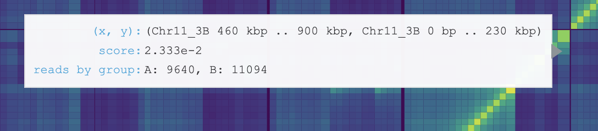

# Manual
## Summary
Smoother is an interactive analysis and visualization software for nucleic acid interactome data that allows the change of parameters such as normalisation, bin size or MAPQ on the fly. Smoother can load multiple samples which can be grouped and compared. Smoother also allows filtering by annotations and the display of coverage for additional sequencing data. 


Smoother is centred around an index including the genome, annotations and datasets to be analysed and visualised. Using this index, Smoother is the first tool that allows changing analysis parameters on-th-fly.

## Installation
The easiest way to install Smoother is via pip

    pip install biosmoother

This will install `biosmoother`, the graphical user interface, and `libbiosmoother`, the backend behind the GUI and the command-line interface.

### Compiling yourself
For installing Smoother via GitHub, run the following commands:

    # clone repository
    git clone https://github.com/Siegel-Lab/BioSmoother.git

    # create the required conda environment
    ./conda_env/create_smoother_env.sh

    # install using pip
    pip install -e .

While the pip installation will install the latest stable release, this type of installation will install the newest, possibly untested version. Note that this approach does still use pip to install the latest stable release of libBioSmoother and libSps, the two backend libraries behind Smoother. To also install these two libraries on your own, you will have to clone the respective repositories and install manually from them using the `pip install -e .` command. Then you can install Smoother using `pip install -e . –no-deps` to install Smoother without adjustments to the dependencies.

## Command organization into main and subcommands
Smoother has multiple sub-commands, all of which interact with an index directory. An index contains the genome, its annotations, as well as the datasets to be analysed and visualised. Each of the subcommands is designed to perform one specific task on the index. For example, there are the `init` and `serve` subcommands that can be called as follows:

	biosmoother init ...
	biosmoother serve ...

To see the main help page, run:

    biosmoother -h

To see the help pages of the individual subcommands (e.g. for `init`), run:

    biosmoother init -h

A complete list of subcommands can be found [here](https://biosmoother.readthedocs.io/en/latest/Cli.html). The following chapters explain how to use the subcommands for creating and interacting with indices.

## Creating an index
All data to be analysed and visualized on Smoother needs to be precomputed into an index. In the next chapters we will explain how to initialize an index and fill it with data.

### Initializing an index
Before an index can be filled with interactome data, we have to set it up for a given a reference genome. Generating an empty index is done using the `init` sub-command. The command outputs an index directory.

Let us create a new index for a Trypanosome genome.

	biosmoother init my_index tryp.sizes

This command will create a folder called `my_index.smoother_index`. In all other subcommands, we can now use `my_index` to refer to this index. `tryp.sizes` is a file that contains the contig sizes of our genome. It looks something like this:

	#contig_name contig_size
	chr1 844108
	chr2 882890

If we have a .gff file, containing annotations for our genome, we must include this file right when creating the index:

	biosmoother init my_index tryp.sizes tryp_anno.gff

This gff file must match the [GFF specifications](http://gmod.org/wiki/GFF3), and looks something like this:

	Chr1   EuPathDB   gene   33710   34309   .   -   .   ID=Tb427_010006200.1;description=hypothetical protein / conserved
    Chr2   EuPathDB   rRNA   1582219 1583848 .   -   .   ID=Tb427_000074200:rRNA;description=unspecified product

.. Important::
    Currently we recommend Smoother only for genomes < 150Mbp in size, as Indices might become very large (multiple hundreds of gigabytes) otherwise. The easiest way to reduce index size is to increase the base resolution of the index. For this, you can use the `-d` parameter of the `init` sub-command. The base resolution is the highest resolution that can be displayed, so do not set it lower than the resolutions you are interested in.

The full documentation of the `init` sub-command can be found [here](https://biosmoother.readthedocs.io/en/latest/Cli.html#init).

### Adding replicates to an index
Adding data for a sample or replicate to an index is done with the `repl` sub-command. This requires an input pairs file containing the two-dimensional interactome matrix for the aligned reads. Pre-processing of the data and input pairs file generation are explained in detail in the next section.

The basic usage of the `repl` subcommand is as follows:

	biosmoother repl my_index replicate_data.tsv replicate_name

Here, `my_index` is the index the data shall be added to, `replicate_data.tsv` is a file containing the actual data, and `replicate_name` is the displayname of that dataset in the user interface.
There is a way to load gzipped (or similar) datafiles into Smoother using pipes:

	zcat replicate_data.tsv.gz | biosmoother repl my_index – replicate_name 

The full documentation of the `repl` sub-command can be found [here](https://biosmoother.readthedocs.io/en/latest/Cli.html#repl).

#### Input format for the repl command
Smoother requires a whitespace (space or tab) delimited input pairs file containing the two-dimensional interactions. Each input pairs file contains the data for one sample or replicate to be analysed and visualised. Each line in the file has the information for one interaction (i.e. two reads).

The default format for the input pairs file is compatible with the output from pairtools and corresponds to the following `-C` option for the repl sub-command: `-C [readID] chr1 pos1 chr2 pos2 [strand1] [strand2] [.] [mapq1] [mapq2] [xa1] [xa2] [cnt]`. Such a file would, for example, look something like this:

    SRR7721318.88322997     chr1  284     chr1  4765    -       +       UU      0       0
    SRR7721318.659929       chr1  294     chr1  366     +       -       UU      29      29      chr5,-1363,3S73M,2;chr11,+1132,73M3S,2;  chr6,-1131,2S74M,2;
    ...

Smoother also supports input files formatted as count matrices. For this, please use the `-C` option `chr1 pos1 chr2 pos2 cnt`. However, the limited information in such files won't allow Smoother to perform analyses at its full potential: Count matrices are already binned and thus the 'pos' columns correspond to the bin position. Hence, setting a smaller base resolution (with the `-d` option in the `init` sub-command) or using annotation filtering will not provide useful information and should be avoided. This is the case, since the individual positions of reads have been lost by using a count matrix file. So, filtering by annotation will only be able to consider the bin locations instead of the actual read locations. Similarly, the base resolution of the heatmap will be limited by the bin size of the count matrix. For example, if the input pairs file has a bin size of 10 kbp, the heatmap will not be able to display a resolution higher than 10 kbp. A count matrix would look something like this:

    chr1    1    chr1      1    123
    chr1    1    chr1  10000     57

See the table below for a summary of filtering functionalities of Smoother depending on the input file format with which the index has been generated:

<figure align=center>

<figcaption> <b>Figure:</b> Summary of filtering functionalities of Smoother depending on the input pairs file. <b>A</b>: column must exist; <b>X</b>: column cannot exist; <b>Y</b>: column exists; <b>N</b>: column does not exist; <b>On</b>: filter is active; <b>Off</b>: filter is inactive; <b>Off*</b>: filter can be active, but it is uninformative because position is binned</figcaption>
</figure>


The `-C` option accepts optional columns, e.g. with `-C [readID] chr1 pos1 chr2 pos2 [strand1] [strand2]`, readId, strand1 and strand2 are optional.
In this case the input pairs file can contain rows with any of the following formats:

    readID chr1 pos1 chr2 pos2 strand1 strand2
    readID chr1 pos1 chr2 pos2 strand1
    readID chr1 pos1 chr2 pos2
    chr1 pos1 chr2 pos2


The following columns can be included in the input pairs file:
- `readID`: sequencing ID for the read or read name
- `chr`: chromosome (must be present in reference genome)
- `pos`: position in baspairs
- `strand`: DNA strand (+ or -)
- `.`: column to ignore
- `mapq`: mapping quality
- `xa`: XA tag from BWA with secondary alignments with format (chr,pos,CIGAR,NM;)
- `cnt`: read count frequency of row interaction. 

.. Important::
    In the case of asymmetric data (like RNA-DNA interactome), 1 is the data displayed on the x axis (columns) and 2 is the data displayed on the y axis (rows). As default RNA is on the x axis and DNA on the y axis; however, this can be modified interactively after launching Smoother.


In the following sub-sections, we describe examples of the pre-processing workflow from raw demultiplexed fastq files to input pairs files for symmetric and asymmetric data sets.

#### Preprocessing data for the repl command

##### Symmetric data sets, such as Hi-C or Micro-C
The following steps are one example that can be followed to produce the input pairs files necessary to generate the index for Smoother from raw Hi-C data.

(@todo ABS: is there no need of step inputting the restriction enzyme(s) used to understand what are valid pairs, right? I see pairtools also have a restrict command...; MS: Maybe we should indicate, where such a step would go, ad say that it depends on the technique.)

The raw read files are mapped to the reference genome using bwa mem.

    bwa mem -t 8 -SP ${GENOME_NAME}.fna ${READ_FILE_1} ${READ_FILE_2}

Find ligation junctions and make pairs file using `pairtools parse` with the following options:
- `--drop-sam`: drop the sam information
- `--min-mapq 0`: do not filter by mapping quality
- `--add-columns mapq`,XA: add columns for mapping quality and alternative alignments
- `--walks-policy mask`: mask the walks (WW, XX, N*) in the pair_type column

```
    pairtools parse --drop-sam --min-mapq 0 --add-columns mapq,XA --walks-policy mask ${GENOME_NAME}.sizes
```

Filter out the walks (WW, XX, N*) from the pairs file using pairtools select

    pairtools select '(pair_type!="WW") and (pair_type!="XX") and not wildcard_match(pair_type, "N*")' {OUTPUT_PARSE}.pairs

Sort the output using pairtools sort

    pairtools sort --nproc 8 {OUTPUT_SELECT}.pairs

Deduplicate the output using pairtools dedup

    pairtools dedup {OUTPUT_SORT}.pairs

Generate the final pairs file that will be the input for generating Smoother index using pairtools split

    pairtools split {OUTPUT_DEDUP}.pairs --output-pairs ${SAMPLE_NAME}.pairs.gz

Below an example of some lines of a Hi-C input pairs file that can be used to generate the Smoother index.

@todo Here paste first lines of one input Hi-C pairs file, formatted as text file.


##### Asymmetric data sets, such as RD-SPRITE, or RADICL-seq
The following steps are one example that can be followed to produce the input pairs files necessary to generate the index for Smoother from single-read raw RADICL-seq (ref @todo) data.

First round of extraction of the RNA and DNA tags from the chimeric reads containing the RADICL adapter sequence using tagdust. Here read1 will be RNA and read2 will be DNA.

    tagdust -1 R:N -2 S:CTGCTGCTCCTTCCCTTTCCCCTTTTGGTCCGACGGTCCAAGTCAGCAGT -3 R:N -4 P:AGATCGGAAGAGCACACGTCTGAACTCCAGTCAC {READ_FILE} -t 38 -o {out1_R1D2}

Second round of extraction of the RNA and DNA tags from the chimeric reads containing the RADICL adapter sequence using tagdust. Here read1 will be DNA and read2 will be RNA.

    tagdust -1 R:N -2 S:ACTGCTGACTTGGACCGTCGGACCAAAAGGGGAAAGGGAAGGAGCAGCAG -3 R:N -4 P:AGATCGGAAGAGCACACGTCTGAACTCCAGTCAC {out1_R1D2} -t 38 -o {out2_D1R2}

Concatenate two files with RNA reads using fastx_toolkit.

    cat {out1_R1D2_READ1}.fq > {RNA}.fq
    cat {out2_D1R2_READ2}.fq | fastx_reverse_complement -Q33 >> {RNA}.fq

Concatenate two files with DNA reads using fastx_toolkit.

    cat {out1_R1D2_READ2}.fq | fastx_reverse_complement -Q33 >> {DNA}.fq
    cat {out2_D1R2_READ1}.fq > {DNA}.fq

The RNA and DNA read files are mapped to the reference genome using bwa aln with -N parameter to keep the multimapping reads.

    bwa aln -N ${GENOME_NAME}.fna {RNA}.fq > {RNA}.sai
    bwa aln -N ${GENOME_NAME}.fna {DNA}.fq > {DNA}.sai

Convert the output from the alignment to SAM format with a value for the -n parameter high enough to keep all interesting multimapping reads.
 
    bwa samse -n 60 ${GENOME_NAME}.fna {RNA}.sai {RNA}.fq > {RNA}.sam
    bwa samse -n 60 ${GENOME_NAME}.fna {DNA}.sai {DNA}.fq > {DNA}.sam
 
Generate tab-separated text files for RNA and for DNA with the information from the SAM files and adding dummy values (notag) if there is no XA tag. (@todo MS: can we format this somehow to make it more readable?)

    cat {RNA}.sam | awk -F '\t' 'BEGIN {OFS="\t";ORS=""} {if ($1 ~ !/^@/ && $3 ~ !/*/) {print $3,$4,$1,$5; for(i=12;i<=NF;i+=1) if ($i ~ /^XA:Z:/) print "",$i; print "\n"}}' | awk -F '\t' 'BEGIN {OFS="\t";ORS=""} {print $1,$2,$3,$4; if(NF<5) print "\tnotag"; else print "",$5; print "\n"}' >> {RNA}
    cat {DNA}.sam | awk -F '\t' 'BEGIN {OFS="\t";ORS=""} {if ($1 ~ !/^@/ && $3 ~ !/*/) {print $3,$4,$1,$5; for(i=12;i<=NF;i+=1) if ($i ~ /^XA:Z:/) print "",$i; print "\n"}}' | awk -F '\t' 'BEGIN {OFS="\t";ORS=""} {print $1,$2,$3,$4; if(NF<5) print "\tnotag"; else print "",$5; print "\n"}' >> {DNA}
 
Sort the RNA and DNA tab-separated text files.

    sort -k1,1 -k2,2n {RNA} > {RNA_k1k2}
    sort -k1,1 -k2,2n {DNA} > {DNA_k1k2}
    sort -k3,3 {RNA_k1k2} > {RNA_k3}
    sort -k3,3 {DNA_k1k2} > {DNA_k3}

Merge the RNA and DNA files based on the sequencing ID (column 3) to generate a single interactome file.

    join -j 3 {RNA_k3} {DNA_k3} | awk 'BEGIN{OFS="\t"}{print $2,$3,$1,$4,$5,$6,$7,$1,$8,$9}' > {R_D}

Sort the merged interactome file {R_D} by genomic location of the RNA interaction partner. 

(@todo ABS: I think this and the next steps are in fact no needed? And I guess everything could anyway be easily piped.This was how I was doing in old way but never tried with new flexible input format, should I modify for that or we just cut down all the sortings?; MS: We do not need sorted input files anymore, but it would be cool to add the import command with the proper --columns)

Below an example of some lines of a RADICL-seq input pairs file that can be used to generate the Smoother index.

 
    @todo Here paste first lines of one input RADICL pairs file, formatted as text file.

### Adding tracks to an index
Adding uni-dimensional data to an index is done with the `track` sub-command. Such uni-dimensional data is displayed as coverage tracks next to the main heatmap. Pre-processing of the data and input file generation are explained in detail in the next section (3. @todo).

The basic usage of the `track` subcommand is as follows:

	biosmoother track my_index track_data.tsv track_name

Here, `my_index` is the index the data shall be added to, `track_data.tsv` is a file containing the actual data, and `track_name` is the displayname of that dataset in the user interface.
There is a way to load gzipped (or similar) datafiles into Smoother using pipes:

	zcat track_data.tsv.gz | biosmoother repl my_index – track_name 

The full documentation of the `track` sub-command can be found [here](https://biosmoother.readthedocs.io/en/latest/Cli.html#track).

#### Input format for the track command
@todo
#### Preprocessing data for the track command
@todo
### Correcting an index for aneuploidy
Many genomes are aneuploid or comprise high levels of heterozygosity in their chromosomes to the extent that correction for practical ploidy is required in order to not over- or under-represent reads coming from these regions (@todo ABS: I think you should not say that chromosomes have different ploidies as that is not really correct, and interactions are not only distributed in polyploid because diploid does not count as polyploid that is only from 3 chromosome sets; MS: can you check the methods section of the paper, if you would agree with the wording there? then we can use basically the same here i think). Smoother can correct for these genomic imbalances by distributing interactions among varying-ploidy contig sets (@todo see section 4.3.2. Normalise) and this ploidy correction can also be run independently of launching Smoother with the ploidy sub-command.

#### Input format for the ploidy command

We have designed a custom format for correcting an index for aneuploidy. This format is a tab-separated text file with two columns: `source` and `destination`. All lines starting with a `#` are ignored.
Entries in the `source` column contain the contig names of the genome assembly, exactly as they were specified in the `.sizes` file given to the `init` command. Entries in the `destination` column contain the contig names of the genome assembly, as they should be displayed in the user interface.

Correcting for ploidy is done by listing the same `source` for multiple `destination` columns. In the example below, we have the contigs `Chr1_core`, `Chr1_5A`, `Chr1_3A`, `Chr1_5B`, and `Chr1_3B` which express a chromosome with a homozygous core but heterozygous telomeres. We correct for `Chr1_core` having 2 physical copies but all other contigs having only one, by listing `Chr1_core` as the `source` for `Chr1_coreA` and `Chr1_coreB`.

Finally, there are `---` lines in the ploidy file. These lines are used to deliminate groups. The purpose of groups is to limit the correction to within the groups. For example: We want interactions between `Chr1_core` and `Chr1_5A` to occur in `Chr1_coreA`-`Chr1_5A`, not in `Chr1_coreB`-`Chr1_5A`. We achieve this by placing `Chr1_coreA` and `Chr1_5A` in the same group. Interactions between `Chr2_5A` and `Chr1_core`, will be split evenly between `Chr2_5A`-`Chr1_coreA` and `Chr2_5A`-`Chr1_coreB`, since `Chr2_5A` and `Chr1_core` are never in the same group.


Here is an example ploidy file:

    #columns: Source Destination
    # chr1A
    Chr1_5A     Chr1_5A
    Chr1_core   Chr1_coreA
    Chr1_3A     Chr1_3A
    ---
    # chr1B
    Chr1_5B     Chr1_5B
    Chr1_core   Chr1_coreB
    Chr1_3B     Chr1_3B
    ---
    # chr2A
    Chr2_5A     Chr2_5A
    Chr2_core   Chr2_coreA
    Chr2_3A     Chr2_3A


## Using the graphical user interface

### Launching the graphical user interface
Launching the Smoother interface for an existing index is done with the `serve` sub-command. If an index has already been launched before, the session will be restored with the parameters of the last session, as they are saved in the session.json file in the index directory. The Smoothers interface makes use of the [Bokeh library](http://bokeh.org). For example, this is how we would launch an index called `my_index`:

	biosmoother serve my_index –show

The full documentation of the `serve` sub-command can be found [here](https://biosmoother.readthedocs.io/en/latest/Cli.html#serve).

#### Port forwarding on a server that uses slurm

Smoother is set up to be run on a server with the [Slurm Workload Manager](https://slurm.schedmd.com/overview.html "Go to the Slurm Webpage").

For this, you need to forward a port from the compute node overthe master node to your local computer. This port forwarding allows you to reach the Smoother application with the webbrowser of your local computer even though it is is running on one of the client nodes on the server. First, log into the main node of the server with ssh port forwarding. The default port that needs to be forwarded is 5009; this requires the following login command:

    ssh -L 5009:localhost:5009 -t your_user_name@your_server

Now any internet-traffic that is using the port 5009 is directed to the server you just logged in to.
Then queue into one of the client nodes on the server by:

    srun --pty bash

Now forward the port from the client node to the master node:

    ssh -fNR 5009:localhost:5009 ${SLURM_JOB_USER}@${SLURM_LAUNCH_NODE_IPADDR}

This command will ask you for your password. After entering it, the port forwarding is set up and you can launch Smoother on the client node. The command to launch Smoother is:

    conda activate Smoother # activate the conda environment if necessary
    biosmoother serve my_index --port 5009

The command will print an url on your terminal.
Follow this url with any webbrowser to open Smoother on the server.
To allow multiple users to use Smoother at the same time, you can use a different port for each user.

.. Important::
    Remember to undo the port forwarding from the client to th master node after you are done using Smoother and before you log out. This can be done by killing the ssh command: `killall ssh`.

#### Setting up a webserver with Smoother

Since Smoother is a web application, it can be set up as a webserver. This allows multiple users to access Smoother at the same time. To do this, you can use the `--keep_alive`, and `--no_save` options, so that Smoother does not shutdown once one user leaves and does not save the changes made by one user for the next user. To allow other machines connecting to the serer, you have to configure the `--allow-websocket-origin` option. For example, to allow connections from any machine, you can use the following command: `--allow-websocket-origin=*`.


### Overview of Smoother's interface

Smoother's interface consists of several panels:
- Navigation bar
- Plot tools
- Primary data
- Secondary data
- Annotations panel
- Coordinate axis
- Regions axis
- Status bar
- Settings tabs

Components can be shown and hidden using the :kbd:`View->Panels` :guilabel:`Show / Hide` dropdown menu.
The Annotation and the Secondary data panel hide theselves automatically if they do not contain data.

<figure align=center>

<figcaption> <b>Figure:</b> Smoothers' Panels labeled by name. </figcaption>
</figure>

On the right-hand side of the interface, there are several tabs with buttons and sliders. These can be used to change several analysis parameters on-the-fly.

### Navigation on Smoother
Navigation on Smoother is controlled by the panels on the top. On the top left, the two arrows allow undoing and redoing changes. (@todo ABS:do they? Haha, MS: don't they? If they don't its a bug. Ohoh.) On the top central panel, the coordinates for the visible region are displayed and can be modified to navigate to a region of interest, as described in the navigation bar chapter below. On the top right, several tools to interact with the plots can be activated (see the plot tools chapter below).

#### Plot tools
The control panel on the top right corner has the following buttons from left to right: :guilabel:`Pan`, :guilabel:`Box zoom`, :guilabel:`Wheel zoom`, :guilabel:`Hover`, :guilabel:`Crosshair`, and :guilabel:`Reset`.

<figure align=center>

<figcaption> <b>Figure:</b> Smoother's Plot tools. </figcaption>
</figure>

- :guilabel:`Pan` enables navigation by clicking and dragging in the plots.
- :guilabel:`Box zoom` allows to zoom into a region of interest by selecting the region with a box.
- :guilabel:`Wheel zoom` enables zooming in and out by scrolling. 
- :guilabel:`Hover` displays information for the genomic coordinates, interaction score, and reads by group for the current bin of the heatmap. :guilabel:`Hover` also displays information of the name and colour of displayed coverage tracks and the scores for the current bins in the coverage track.
- :guilabel:`Crosshair` highlights the row and column coordinates of the current location.
- :guilabel:`Reset` resets the heatmap to default settings.

<figure align=center>

<figcaption> <b>Figure:</b> Hovering over a bin in the heatmap with the Hover tool enabled. </figcaption>
</figure>
(@todo MS: please cut the image, so that the hover tooltip can be seen. Do we need to explain the tooltip? also, can we put a screenshot of hovering over a track?)

#### The Navigation bar
The :guilabel:`Navigation bar` on the top centre of the graphical interface displays the currently visible region, every time Smoother renders a new heatmap. However, you can also input a location into the bar and Smoother will jump to that location in the heatmap.

<figure align=center>

<figcaption> <b>Figure:</b> Navigating on smoother using the Navigation bar. </figcaption>
</figure>

For this, click into the :guilabel:`Navigation bar` and replace the text with the region you want to jump to. (A simple way to replace all text in the bar is clicking into it and hitting *control-a*, then typing the new location).

The bar accepts the following syntax and various short forms of if:

	X=[chrX1: 10 kbp .. chrX2: 100 kbp] Y=[chrY1: 20 kbp .. chrY2: 200 kbp]

Here, `chrX1: 10 kbp` is the start horizontal location, while `chrX2: 100 kbp` is the horizontal end location. The same goes for `chrY1` and `chrY2` as the vertical start and end locations. Several units are accepted: `bp`, `kbp`, and `Mbp`. The square brackets around the coordinates of either axis are optional. Note that two dots `..` are used to delimitate the start and end locations on an axis; this is essential, you cannot use one, three or more dots.

If you want to merely change the range of the x-axis, you can omit the `Y=[...]` portion of the command (vice versa for the y-axis).

	X=[chrX1: 10 kbp .. chrX2: 100 kbp]

If you want to change both axis to the same region, simply drop the `X=` and `Y=`

	chr1: 10 kbp .. chr2: 100 kbp

If the entire contig shall be visible, coordinates can be omitted:

	chr1 .. chr2

Here the heatmap would include `chr1` and `chr2` fully: I.e., start at the beginning of `chr1` and end at the ending of `chr2`. If `chr1` equals `chr2`, this can be expressed even simpler:

	chr1

Let's say you want to display `chr1`, with `100 kbp` of extra space around it, you could use the following command:

    chr1: +- 100 kbp

Instead of adding extra space around the entire contig, one can also pick a specific position. For example, one could show the region from 400 kbp to 600 kbp on chr1.

	chr1: 500 kbp +- 100 kbp

Further, showing the region from `100 kb` to `200 kbp` on `chr1` is also possible:

	chr1: 100 kbp .. 200 kbp

Negative coordinates are allowed, the following command will show a 200 kbp region centred around the start of chr1:

	chr1: -100 kbp .. 100 kbp

Capitalization does not matter for all inputs to the :guilabel:`Navigation bar`. 


.. Hint::
    Inputting a `*` into the :guilabel:`Navigation bar` will make the full heatmap visible.

### Status bar

The status bar displays a bunch of information about the current state of Smoother.
- *Bin size*: First, the size of the currently visible bins is shown. If bins are square, one number is given, while for rectanglar bins the size is given as `width` x `height`.
- *Times*: Next, Smoother display the time it took to process and render the currently visible heatmap.
- *Number of bins*: Then, the total number of bins is shown.
- *Errors*: Finally, if there are any errors, they are displayed here.

If you trigger Smoother to rerender the heatmap, the status bar will display that smoother is rendering and the reason why.

### The File tab
In the :kbd:`File` tab of Smoother, there are three sub-tabs\: :kbd:`->Presetting`, :kbd:`->Export`, and :kbd:`->Info`.

#### The Presetting sub-tab
:kbd:`File->Presetting` allows performing analysis with predetermined settings. Three analyses are already preconfigured and available on Smoother for doing normalisations as in GRID-seq (@todo ref), RADICL-seq (@todo ref), as well as one for Hi-C data. It is also possible to save the current settings configured on Smoother as a new presetting.

#### The Export sub-tab
:kbd:`File->Export` allows to save the interactome data with the settings of the current session either as a TSV text file or as a picture in SVG or PNG format. It is possible to export only the visible region or the full heatmap using the :guilabel:`export full matrix instead of visible region` checkbox.
-	The path for the exported files can be specified on the :guilabel:`Output Prefix` box.
-	The format can be selected clicking on the :guilabel:`Format` dropdown.
-	If files need to be exported to the server instead of downloading them it is possible to tick the box :guilabel:`Export files to server instead of downloading them`
-	The pixel size for coordinates, contigs, secondary axis and stroke width can be selected prior to export.
-	When saving as TSV, 3 files are saved, one for the interactome, and one for each axis.

Exporting with settings thus allows to save interactome data with all active filters, normalisation, comparison between groups, and even virtual 4C analyses. 

#### The Info sub-tab
:kbd:`File->Info` provides a log of Smoother processes, which are also displayed on the command line.
-	:guilabel:`Download current session` allows exporting the metadata by downloading all the parameters of the current session.

### The Normalize tab
In the :kbd:`Normalize` tab of Smoother, there are three sub-tabs\: :kbd:`->Main`, :kbd:`->Dist. Dep. Dec.`, and :kbd:`->Ploidy`.

#### The Main sub-tab
Several normalisations are available in the :kbd:`Normalize->Main` sub-tab to normalise the heatmap or the coverage track. Using the :guilabel:`Normalize heatmap by` dropdown, the heatmap and coverage can be normalised by `Reads per million` or `Reads per thousand` on the visible region. It is worth noting that the visible colour changes automatically on screen (can be modified on the View tab) and thus the heatmap might not change visually between `No normalisation`, `Reads per million`, or `Reads per thousand`. However, the values of the bins do change, and they are what is relevant for exporting the TSV text file for downstream analyses. The coverage can also be normalised by `Reads per million base pairs` and `Reads per thousand base pairs`, so that normalisation can be done by the size of the bin, indicating the density of reads in one million or thousand base pair squared.

The other normalisations available for heatmap on Smoother are performed with a sampling strategy that also considers some bins outside of the visible area for normalisation (@todo ref Smoother paper needed or not). The normalisations available for the heatmap (also in the :guilabel:`Normalize heatmap by` dropdown) based on the sampling strategy are `Binomial test` (@todo ref RADICLseq), `Iterative correction` (@todo ref) and `Associated slices` (@todo ref GRID-seq). The number of samples taken outside the visible region can be modified on the slider bar :guilabel:`Number of samples` to ensure the lowest deviation from normalising to the entire heatmap (@todo ref Smoother paper needed or not, but that is only for our genome...). 

.. Hint::
    If it is essential that the normalisation runs on the entire heatmap it is possible to export the interactome and generate a new index on Smoother with the normalised data that allows zooming in to regions normalised to the entire heatmap. 

The `Binomial test` and `Associated slices` normalisations are implemented for asymmetric RNA-DNA interactome data and `Iterative correction` is the default normalisation for Hi-C data.

##### Binomial test normalization

`Binomial test`\: determines statistical significance of each bin over the genome-wide coverage of the interacting RNA. A slider bar allows to modify the :guilabel:`pAccept for binomial test` which is the value at which the p-values is accepted as significant. It is possible to select the option to display coverage of the normalisation in the secondary data panel using the :guilabel:`Display coverage as secondary data` checkbox. It is also possible to change the axis in which the normalisation is performed (:guilabel:`Apply binomial test to columns`), by default this normalisation is performed row-wise but if the box is ticked the normalisation is performed column-wise. 

##### Associated slices normalization

`Associated slices`\: normalises each bin by the sum of *trans* chromatin-associated slices of the interacting RNA. First, chromatin-associated slices need to be determined. For this, we compute the *Average RNA reads per kb* and the *Maximal DNA reads in a bin* for a set of slices. You can adjust the :guilabel:`Number of samples` taken, using the so-named slider. Slices are chosen from a type of annotation. The specific :guilabel:`Annotation type` can be picked using a dropdown button. For the *Maximal DNA reads*, horizontal binsize of slices within the slices can be adjusted using the :guilabel:`Section size max coverage` slider. *Average RNA reads* are always normalized to 1 kb bins. Slices are considered as chromatin-associated if they fall into the ranges set by the :guilabel:`RNA reads per kbp bounds` and :guilabel:`Maximal DNA reads in bin bounds` sliders. To visualize the effects of these bounds, two plots show the distribution of the *Average RNA reads per kb* and the *Maximal DNA reads in a bin* for the selected slices. Grey dots indicate slices that are filtered out. Finally, bins are normalized by the *trans* coverage of the slices. You can display this coverage using the :guilabel:`Display background as secondary data` checkbox. (@todo MS: we need pictures here!) (For comprehensive computational explanation of this normalisation see ref Smoother paper, ref grid-seq paper). In (ref grid-seq), they use this normalization in combination with filtering out reads that do not overlap genes on their RNA read (see the @todo filtering->blabla tab).

It is possible to change the axis in which the normalisation is performed using the :guilabel:`Compute background for columns` checkbox, by default this normalisation is performed column-wise but if the box is un-ticked the normalisation is performed row-wise. A tick box allows to choose whether to use the intersection of chromatin-associated slices between datasets as background, otherwise the union of slices is used. This is relevant because the normalisation is done separately on the datasets, but to make the normalisation match between the datasets, the chromatin-associated slices need to match. The :guilabel:`Ignore cis interactions` box also allows to ignore or consider *cis* interactions (within same contig).


<figure align=center>

<figcaption> <b>Figure:</b> Normalizing RNA-DNA interactome data by Associated Slices and Binomial test. </figcaption>
</figure>

##### Iterative correction normalization

`Iterative correction` (IC)\: equalises the visibility of the heatmap by making its column and row sums equal to one. A bias value is computed for every slice (column and row) and IC normalisation of the bins is performed by multiplying the bias of each slice to each slice bin. It is possible to filter out slices with more than the given % of empty bins. A tick box allows to Show bias as tracks in the secondary data panels. It is possible to use only the visible region to compute the IC by ticking the Local IC box. The Mad Max filter slider allows to filter out bins for which the log marginal sum is lower than the given value (see [the Cooler github]( https://github.com/open2c/cooler/blob/0f4cf6e21cea50c92334b87c5c6d5759859f4de8/src/cooler/balance.py#L397)). One slider bar allows to set the threshold for :guilabel:`Minimal number of non-zero bins per slice` and another to define *n* for the Manhattan distance to :guilabel:`Ignore first n bins next to the diagonal`.

#### The Dist. Dep. Dec. sub-tab
The :kbd:`Normalize->Dist. Dep. Dec.` sub-tab allows to perform a distance dependant decay normalisation by selecting the tick box :guilabel:`Normalise Primary`. The distance dependant decay is computed with the mean of the value for all the bins at the same Manhattan distance for the current contig and it can be displayed on a plot below by ticking the box :guilabel:`Display`. On the plot, each line represents a bin with the beginning being the top left corner and the end, the bottom right corner of the bin. The normalisation is calculated by dividing each bin to this mean. It is important to consider that the further away from the diagonal a bin is in a contig, has less bins at the same Manhattan distance (or none for the edge bin). A slider allows to modify the minimum and maximum number of samples to compute the distance dependant decay. The top and bottom percentiles of samples can be excluded from the normalisation with the :guilabel:`Percentile of samples to keep (%)` slider.

<figure align=center>

<figcaption> <b>Figure:</b> Normalizing 3C data by ICing and distance dependent decay. </figcaption>
</figure>


#### The Ploidy sub-tab
The :kbd:`Normalize->Ploidy` tab allows normalisation for practical ploidy. Many genomes are aneuploid or comprise high levels of heterozygosity in their chromosomes to the extent that correction for practical ploidy is required in order to not over- or under-represent reads coming from these regions. Smoother can correct for these genomic imbalances by distributing interactions among varying-ploidy contig sets. The ploidy menu comprises several tick boxes and requires uploading a ploidy file. The format of the ploidy file is described [here](https://biosmoother.readthedocs.io/en/latest/Manual.html#correcting-an-index-for-aneuploidy).

To perform the ploidy correction :guilabel:`do correct` must be ticked and ticking :guilabel:`use ploidy corrected contigs` will trigger Smoother to use the order of contigs from the ploidy corrected file instead of the genome sizes. The correction considers *n*-ploid contigs as *n* instances and interactions are divided evenly among the instances of the contigs. The correction has several options that can be selected on the following tick boxes:
-	`Remove inter-contig, intra-instance interactions` will remove interactions between two different instances of the same contig.
-	`Keep interactions from contig-pairs that are in the same group` (@todo ABS: I think I get that but what is group? Group of contigs making one chromosome?; MS: contig-groups are defined via the ploidy file. Once we put the example this should make it clear hopefully.)
-	`Keep interactions from contig-pairs that never occur in the same group` (@todo ABS: again needs to be explained making clear what is a group)
-	`Remove interactions that are not explicitly kept by the options above`

<figure align=center>
 
<figcaption> <b>Figure:</b> Ploidy Correction. </figcaption>
</figure>

### The Filter tab
In the :kbd:`Filter` tab of Smoother, there are four sub-tabs: :kbd:`->Datapools`, :kbd:`->Mapping`, :kbd:`->Coordinates`, and :kbd:`->Annotations`.

#### The Datapools sub-tab
:kbd:`Filter->Datapools` allows to define the group or condition for every sample and the type of comparison and representation that should be performed among the samples. The :guilabel:`Primary Datapools` table allows to distribute the samples with interactome data displayed on the heatmap in groups by ticking the different pool per sample. The :guilabel:`Secondary Datapools` table allows to select the axis in which the secondary data panel with unidimensional data should be displayed. A dropdown menu allows to :guilabel:`Merge datasets` belonging to the same datapool group by several operations\: `sum, minimum, difference` and `mean`. A second dropdown menu :guilabel:`Compare datapools` by enables the selection of options to display the combined datapools: `sum, show first group a, show first group b, substract, difference, divide, minimum and maximum`.

<figure align=center>

<figcaption> <b>Figure:</b> A visual representation of how datasets are first combined into two datapools, before these datapools are combined in turn. </figcaption>
</figure>

<figure align=center>

<figcaption> <b>Figure:</b> Using the <em>subtract</em> option of the *Compare datapools* dropdown menu, images like this can be generated. </figcaption>
</figure>


#### The Mapping sub-tab
:kbd:`Filter->Mapping` allows filtering interactions by mapping quality scores of their reads. The mapping quality score represents the confidence of the aligner for the correctness of each alignment. The highest possible score is 254 and the lowest is 0. The bounds and thresholds that can be used to filter the reads correspond to those listed as `-m` option when running the init command to generate the index, as default the lower bounds are 0, 3 and 30, and the upper bounds are 3, 30 and 255. The bounds for this filter can be selected on the dropdown menus :guilabel:`Mapping Quality: Lower Bound` and :guilabel:`Mapping Quality: Upper Bound`.


<figure align=center>
 
<figcaption> <b>Figure:</b> Filtering out reads with low mapping qualities. </figcaption>
</figure>

One key functionality of Smoother is the possibility to analyse regions of high homology and repeats as multimapping reads can be kept. To do so, the smallest possible rectangle enclosing all possible alignments for a multimapping read is computed. A dropdown menu allows to select the preferred option to deal with the multimapping reads (MMR) in the scenarios that these rectangles are confined within a bin or overlap more than a bin:
- `Count MMR if all mapping loci are within the same bin`. This is the default option. (@todo ABS: in paper in fact you say this is only option if wanting to keep MMR. And from last times we talked I thought that either they are all in same bin and you keep them all or you ignore them, but here there are many more options which are not so clear to me; MS: I figred it wastoo much clutter for the paper to list them all.)
- `Count MMR if mapping loci minimum bounding-box overlaps bin`. It is important noticing that this will overrepresent the multimapping read as it will be displayed in more than a bin. (@todo ABS: would that be when you display them all so they are over-represented?; MS: exactly!)
- `Count MMR if bottom left mapping loci is within a bin` (ABS: sorry to always ask about this this would mean even if one mapping loci is on top right outside bin but bottom left is in same bin they are displayed?; MS: yes, with this option it only looks at the bottom left-most mapping loci, ignoring all others.)
- `Count MMR if top right mapping loci is within a bin` (@todo ABS:same, I don`t want to explain a lie)
- `Ignore MMRs`. Multi-mapping reads are excluded from the analysis.
- `Count MMR if all mapping loci are within the same bin and ignore non-MMRs`. This option allows analysis only of multimapping reads that are enclosed in a bin. This option can be useful for exploratory purposes.
- `Count MMR if mapping loci minimum bounding-box overlaps bin and ignore non-MMRs`. This option allows analysis of multimapping reads that are not enclosed in a bin. This option can be useful for exploratory purposes.
(@todo ABS: for me, we still would need the option in which if they are not enclosed in a bin they are distributed randomly to one place or another that is the option done also when analysng unidimensional sequencing; MS: which is very hard to implement...)

A tick box allows to show multimapping reads with incomplete mapping loci lists, which correspond to those that have too many mapping locations to be reported with the given maximum when running the mapping (@todo ABS: in fact in my case I choose with -n option how many to show, there is a default number but one can also choose to show more or less; MS: could you document this here then? maybe wth an example command?). It is important to notice that displaying these multi-mappers might introduce noise to the heatmap.


<figure align=center>
 
<figcaption> <b>Figure:</b> Filtering out multimapping reads that overlap multiple bins. </figcaption>
</figure>

The :guilabel:`Directionality` dropdown menu allows choosing whether to display interaction for which interaction partners map to any or a particular strand. The options are the following:
- `Count pairs where reads map to any strand`
- `Count pairs where reads map to the same strand`
- `Count pairs where reads map to opposite strands`
- `Count pairs where reads map to the forward strand`
- `Count pairs where reads map to the reverse strand`

:guilabel:`Coordinates` allows filtering the regions displayed on the heatmap. The :guilabel:`Minimum Distance from Diagonal` slider allows setting a minimal Manhattan distance by filtering out bins that are closer to the diagonal than the set value in kbp. The dropdown :guilabel:`Annotation Coordinate System` menu allow to select the annotation to use as filter. Only annotations that have been listed on the `-f` option when running the `init` command to generate the index are available, as default the filterable annotation is gene. Two tick boxes allow changing the coordinate system from bins to the filterable annotation for rows and/or columns. The dropdown :guilabel:`Multiple Annotations in Bin` gives four options to deal with bins that comprise multiple annotations:
- `Combine region from first to last annotation`
- `Use first annotation in Bin`
- `Use one prioritized annotation (stable while zoom- and pan-ing)` (@todo ABS:how do you prioritize it? Or does it do it automatically? MS: oh yes, this... I will write something!)
- `Increase number of bins to match number of annotations (might be slow)`


(@todo ABS: I still have to finish this section multiple bins for annotation / active contigs / symmetry)


*Annotations* (@todo ABS: I still have to write this section)

<figure align=center>
 
<figcaption> <b>Figure:</b> Filtering out reads that do not overlap a gene. </figcaption>
</figure>


### The View tab
(@todo ABS: I still have to write this section)
In the *View* tab of Smoother, there are five sub-tabs: *Color, Panels, Bins, Virtual4C* and *Rendering*.


#### The Color sub-tab

@todo ...

*Log base slider:* After normalization, the values in each bin are between zero and one. 
Before displaying these values in the heatmap, we apply a logarithmic transformation.
Like with logarithmic scales, this keeps all values in the same order but makes a difference between two small numbers appear bigger than the same difference between two bigger numbers.
You can fiddle with the strength of this effect using the `Color Scale Log Base` slider.
In brief, higher values for the log base increase the difference between small numbers but make larger number look more similar. Lower values do the opposite. Setting log base to zero displays the numbers without any transformation.

In detail, the function we use is:


, where *x* and *y* are the un-normalized and normalized interaction frequencies while *a* is the log base parameter.
With varying values for *a*, this function always satisfies *f(0)=0* and *f(1)=1*.
for *a=0* the function is undefined but approaches the 45-degree diagonal, so we hardcode *f(x)=x* for *a=0*.

### The Panel tab
Bins

	Remainder bin


<figure align=center>

<figcaption> <b>Figure:</b> A visual representation of how the last bin in a contig is placed given the remainder bin option. </figcaption>
</figure>

Extend remainder bin into the next contig. Only visible they are lost for next contig

but that is for the filtering but also for the display when on a zoomed region and changing the bin size no?

I have two figure


For symmetric data, upper triangle can be mirrored to otherwise empty lower triangle interactively on Smoother (in fact this option takes all interactions and displays them in both)


	


Virtual 4C

show all for V4C for example


<figure align=center>

<figcaption> <b>Figure:</b> Smoother performing a virtual 4C analysis. </figcaption>
</figure>

Rendering


## Using the command line interface
All Smoother analyses can also be performed on the command line without the requirement to launch the graphical interface of Smoother. 
### The set command
Running Smoother analyses without launching the GUI requires the set sub-command to define the values of different parameters.
### The get command
The get sub-command allows retrieving the value of a parameter for the current/last session of a given index.
### The export command
It is possible to save the current/last index session to a file with the export sub-command. This corresponds to the function Export of Smoother (see section 4.3.1. File). The interactome data with the settings of the current session can be saves as a TSV text file with the interactions or as a picture in SVG or PNG format.
(MS: We should mention that we basically produce 'publication quality images' with the svg output)

### Resetting an index
To reset to the default parameters for a given index, Smoother implements the `reset` sub-command. Using reset will erase the saved parameters from all previous session for that index. Example:

	biosmoother reset my_index

The full documentation of the `reset` sub-command can be found [here](https://biosmoother.readthedocs.io/en/latest/Cli.html#reset).
