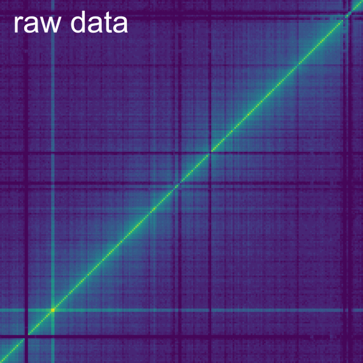
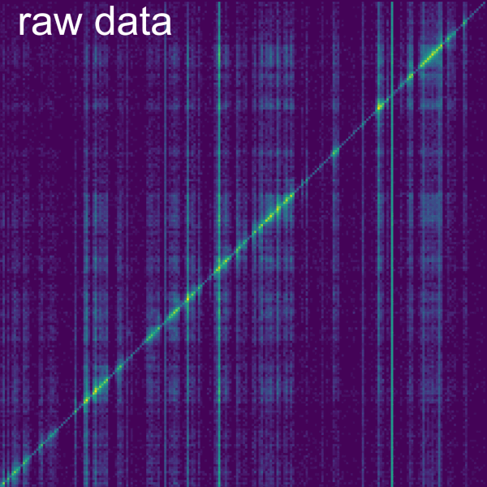
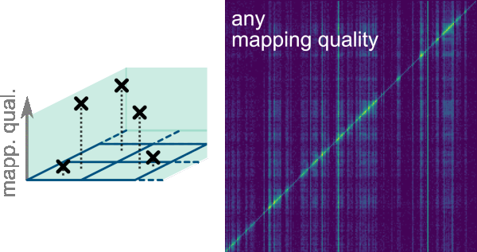
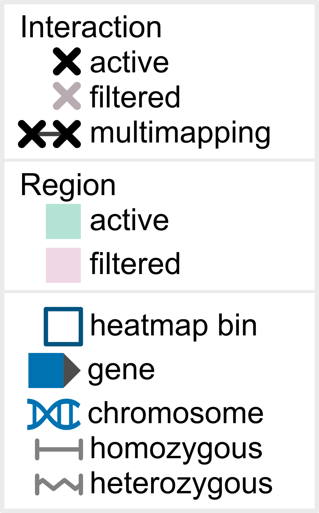
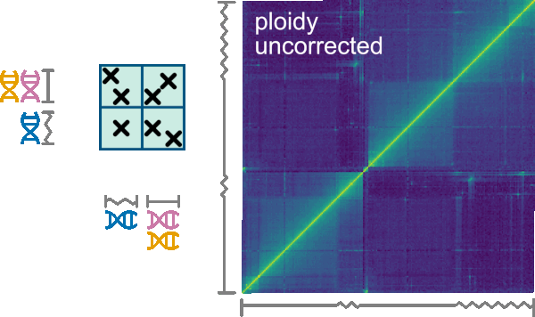
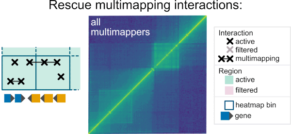
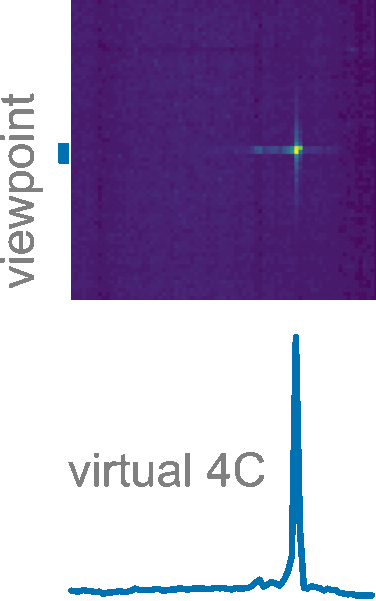
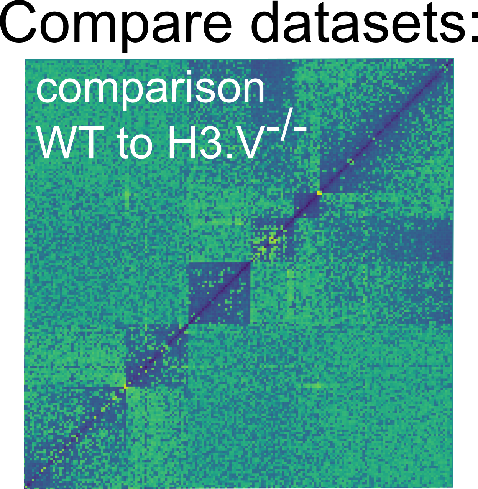
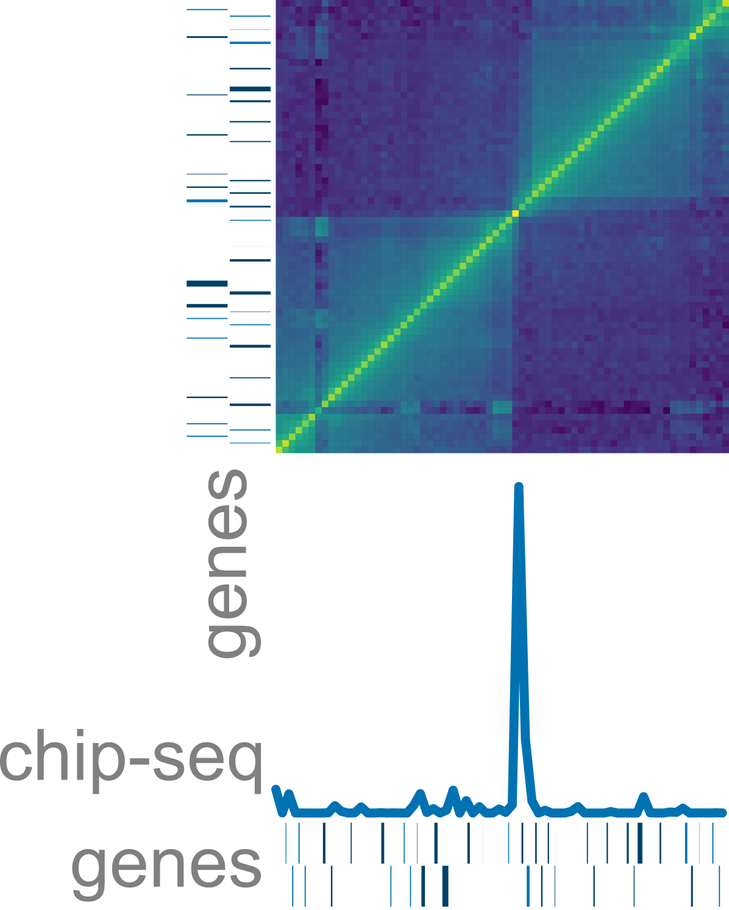

<p align="center">
    
</p>

Smoother is an interactive analysis and visualization software for contact mapping data. 

## Quick Start

create & activate a new environment (optional)
```
conda create -y -n smoother python=3.9
conda activate smoother
```

Install smoother (and all requirements) using pip.
```
pip install biosmoother
conda install -y nodejs # pip cannot install nodejs, so we use conda
```

Download 2 example smoother indices.
```
wget @todo
#wget @todo

conda install unzip
unzip radicl.smoother_index.zip
#unzip micro-c.smoother_index.zip
```

View one of the indices
```
biosmoother serve micro-c --show
#biosmoother serve radicl --show
```

## Manual

A full manual can be found here @todo.

## Overview

In Smoother, parameters can be changed on-the-fly.
This means, a user can click a button or move a slider and will immediately see the effect of that parameter change on screen.
Parameters that can be changed include:

| <h3> Normalization </h3> | |
|-|-|
| <h4 align="center">Normalize 3C data</h4><p align="center"></p><p align="center">Smoother normalizes Hi-C-like data on-the-fly. Hence normalization technique and parameters can be changed interactiveley.</p> | <h4 align="center">Normalize RNA-DNA interactome data</h4><p align="center"></p><p align="center">Smoother normalizes RADICL-seq, GRID-seq, and similar data on-the-fly. Hence normalization technique and parameters can be changed interactiveley.</p> |


| <h3> Filtering </h3> | | |
|-|-|-|
| <h4 align="center">Filter interactions by mapping quality</h4><p align="center"></p><p align="center">The mapping quality of an interaction expresses the aligners confidence that the position of the interaction is correct. Smoother can remove interactions where this confidence is low.</p> | <h4 align="center">Filter interactions by annotation</h4><p align="center"></p><p align="center">Interactions that do not overlap a chosen type of annotation (e.g. genes) can be filtered out. In an additional step, whitespace between the instances of the chosen annotation can be removed.</p> | <h4 align="center">Legend</h4><p align="center"> |
| <h4 align="center">Correct for variable ploidy</h4><p align="center"></p><p align="center">Organisms may have chromosomes with varying ploidy. While for the mapping all copies of a chromosome need to be merged into one sequence, Smoother can subsequently correct the bias that this merging introduces. </p> | <h4 align="center">Rescue multimapping interactions</h4><p align="center"></p></p><p align="center">Interactions that have multiple mapping loci are only counted if all their mapping loci are within the same bin. This feature considers the current bin size.</p> | |


| <h3> Analysis </h3> | | |
|-|-|-|
| <h4 align="center">Virtual 4C</h4><p align="center"></p><p align="center">Smoother computes virtual 4C graphs on-the-fly.</p> | <h4 align="center">Compare two conditions</h4><p align="center"></p><p align="center">Smoother can compare two datasets.</p> | <h4 align="center">Overlays</h4><p align="center"></p><p align="center">Smoother can overlay other sequencing tracks, as e.g. chip-seq data, <br/> as well as genomic annotations onto the heatmap.</p> |


## Loading your own data

All data needs to be converted into a smoother index first.
For this, first create an empty index:
```
biosmoother init my_index my_genome.sizes my_annotation.gff
```
Here, `my_genome.sizes` is a file that contains the length of each chromosome in your genome and `my_annotation.gff` contains the genomes annotations.

Then, add your data to the index:
```
biosmoother repl my_index my_replicate_1.tsv name_of_replicate_1
biosmoother repl my_index my_replicate_2.tsv name_of_replicate_2
...
```
Here `my_replicate_x.tsv` needs to be a tab-separated file with 10 columns: `read_id, chr1, pos1, chr2, pos2, strand1, strand2, pair_type, mapq1, and mapq2`.

Finally, the index can be opened with:
```
biosmoother serve my_index --show
```

## Cite

If you use smoother in your research, please cite:
@todo
