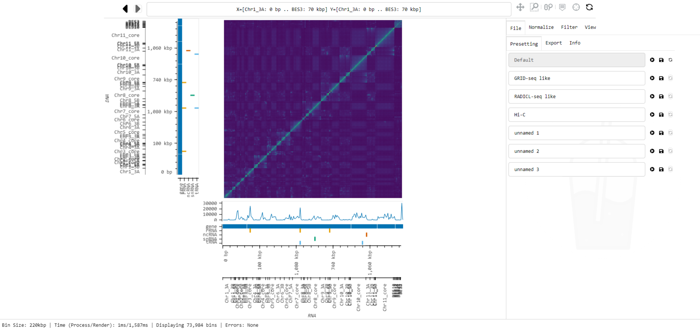

<p align="center">
    
</p>

# Smoother

Smoother is an interactive analysis and visualization software for contact mapping data. 


## Quick Start

:exclamation: If you want an in-detail explanation of installing Smoother and doing a handfull of first steps, [how about taking a tour](https://biosmoother.readthedocs.io/en/latest/Manual.html#taking-a-tour "take a tour") :bus:? 

Otherwise, here is a brief set of instructions to get Smoother running: First, install [conda](https://conda.io/projects/conda/en/latest/user-guide/install/index.html "conda install page") on your machine if you don't have it already.

Then, create & activate a new environment (optional)
```
 conda create -y -n smoother python=3.9
 conda activate smoother
```

Install Smoother (and all requirements) using pip. Smoother runs under Windows, Linux, and MacOS using the Google Chrome, Safari, or Firefox browsers.
```
 pip install biosmoother
 conda install -y nodejs cairo # pip cannot install nodejs and cairo, so we use conda
```

Download 2 example Smoother indices.
```
 conda install wget
 wget https://syncandshare.lrz.de/dl/fiTWvK4pxwB2TQkMSrzzDJ/t_brucei_hi_c.smoother_index.zip
 #wget https://syncandshare.lrz.de/dl/fi8NBv2b3VDt4Htkm8Auuv/m_musculus_radicl_seq.smoother_index.zip
 
 conda install unzip
 unzip t_brucei_hi_c.smoother_index.zip
 #unzip m_musculus_radicl_seq.smoother_index.zip
```

View one of the indices
```
 biosmoother serve t_brucei_hi_c.smoother_index --show
 #biosmoother serve m_musculus_radicl_seq.smoother_index --show
```

From now on, to run smoother you will merely have to activate the environment and run the serve command.
```
 conda activate smoother
 biosmoother serve t_brucei_hi_c.smoother_index --show
```


## Full Documentation

For more information and in-depth instructions, check out the [manual](https://biosmoother.readthedocs.io/ "Smoother's Manual").

## Overview

In Smoother, parameters can be changed on-the-fly.
This means, a user can click a button or move a slider and will immediately see the effect of that parameter change on screen.
Parameters that can be changed include:


Here is a screenshot of Smoother in action:



## Loading your own data

All data needs to be converted into a Smoother index first.
For this, first create an empty index:
```
biosmoother init my_index -a my_annotation.gff
```
Here, `my_annotation.gff` is a GFF file that contains the genomes annotations.

Then, add your data to the index:
```
biosmoother repl my_index my_replicate_1.tsv name_of_replicate_1
biosmoother repl my_index my_replicate_2.tsv name_of_replicate_2
...
```
Here `my_replicate_x.tsv` needs to be a tab-separated file with 10 columns: `read_id, chr1, pos1, chr2, pos2, strand1, strand2, pair_type, mapq1, and mapq2`.

Finally, the index can be opened with:
```
biosmoother serve my_index --show
```

## Cite

If you use smoother in your research, please cite:
@todo
