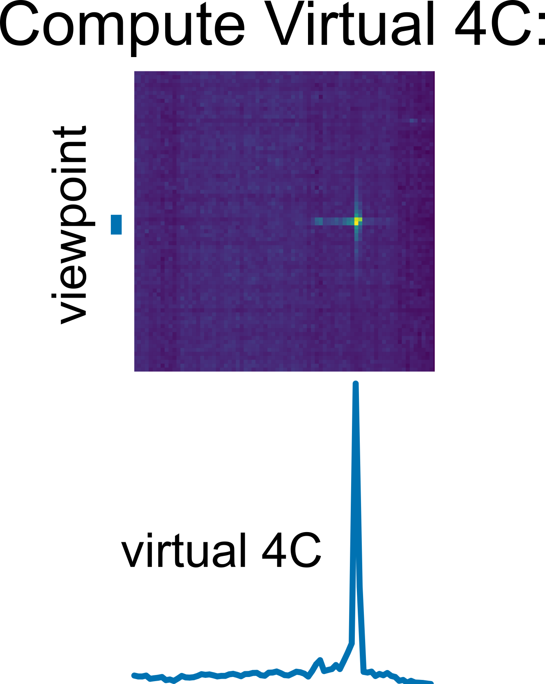

<p align="center">
    
</p>

Smoother is an interactive analysis and visualization software for contact mapping data. 

## Quick Start

create & activate a new environment (optional)
```
conda create -y -n smoother python=3.9
conda activate smoother
```

Install smoother (and all requirements) using pip.
```
pip install biosmoother
conda install -y nodejs # pip cannot install nodejs, so we use conda
```

Download 2 example smoother indices.
```
wget @todo
wget @todo

conda install unzip
unzip radicl.smoother_index.zip
unzip micro-c.smoother_index.zip
```

View one of the indices
```
biosmoother serve micro-c --show
#biosmoother serve radicl --show
```

## Overview

In smoother, parameters can be changed on-the-fly.
This means, a user can click a button or move a slider and will immediately see the effect of that parameter change on screen.
Parameters that can be changed include:


| | | |
|-|-|-|
| <p align="center"></p> | <h3 align="center">Filter interactions by mapping quality.</h3><p align="center"></p><p align="center">The mapping quality of an interaction expresses the aligners confidence that the position of the interaction is correct. Smoother can remove interactions where this confidence is low.</p> | <p align="center"></p> |
| <p align="center"></p> | <p align="center"></p> | <p align="center"></p> |
| <p align="center"></p> | |


