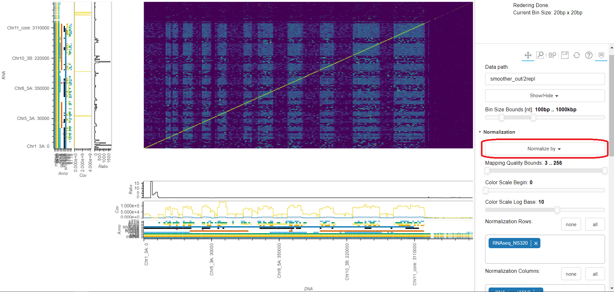
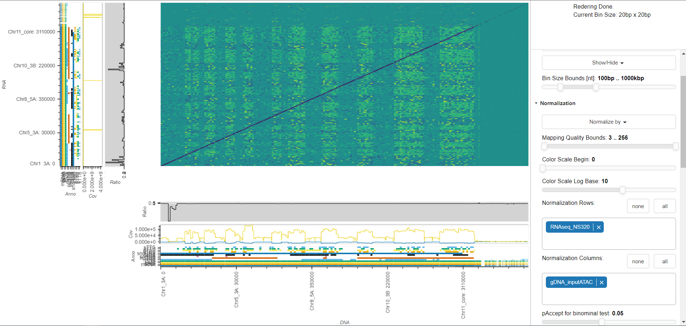
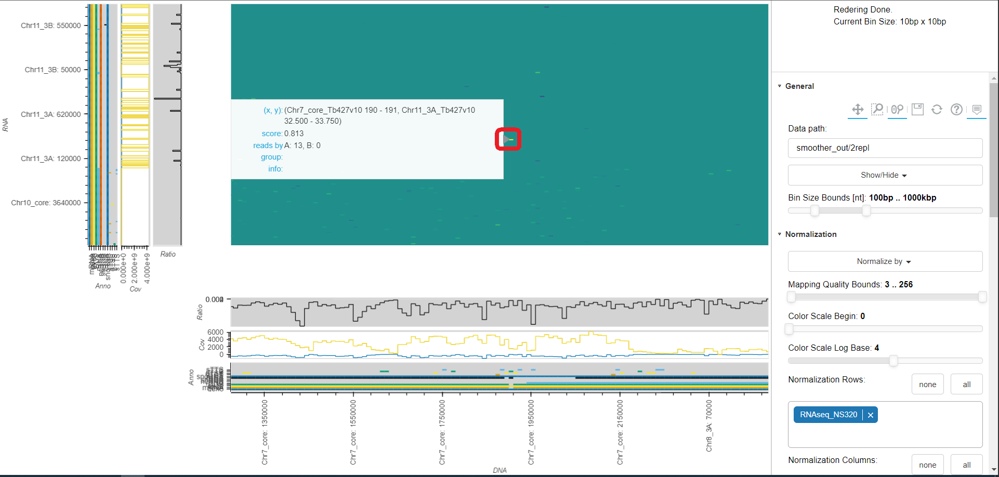

## Viewing Data

### Example Experiments (_Anna_)

#### Example Analysis No. 1 - Markus Departmental

The purpose of this analysis is simply to show some of the features of smoother.

First, we open smoother with one of the sample datasets: 
2 replicates of Anna's data - protein mediated and non-protein mediated RNA-DNA interactions (RADICL-seq).

    For this we open the viewer and type test in General->Data path

The grey lines we see show the borders between contigs.
Our organism is *Trypanosoma Brucei*, which has a lot of minichromosomes - 
these are partially assembled as a lot of small unitigs at the end of the genome.
Since they are so small they show up as a solid grey area to the top-right of the middle plot.

    We remove the grey lines by clicking on General->Show/Hide->Grid Lines.

Next, the size of bins is too large to see anything.

    We go to Interface->Number of Bins and increase the slider.

Next, we want to pick our normalization technique as currently we are looking at un-normalized data.

    We click on Normalization->Normalize by->Row Sum, to normalize the sum of each row to 1

*T. brucei's* genome has a lot of repetitive regions, especially at the telomeres.
Currently all found contact points are rendered;
however, for repetitive regions it is often impossible to map a read to a unique genomic loci.
In such cases mappers will still map the read to one possible genomic loci, but mark the read with a low confidence (i.e. Mapping Quality) value.
These low confidence reads produce a lot of noise.

    We now filter out such low confidence reads by moving the lower bound of the Filters->Mapping Quality Bounds slider from 0 to 3.

Finally, we have 2 replicates loaded.
Currently, they are simply added together after normalization.
We would like to display the differences between them though.

    Hence, we click on Replicates->Between Group->Substract.

We now see a log of differences between the two datasets.
first, we would like to focus on the most striking differences.
For this, we change color scale so that we se more differences between larger number but less between smaller numbers.

    We move the Normalization->Color Scale Log Base slider from 10 to 4.

Now let's inspect onf of the most striking interactions by zooming in.

    For this we click on General->Zoom (the magnifying glass in the toolbar at the top) and drag a rectangle around the interaction we want to inspect further.

    Then, we hover over the interaction.

