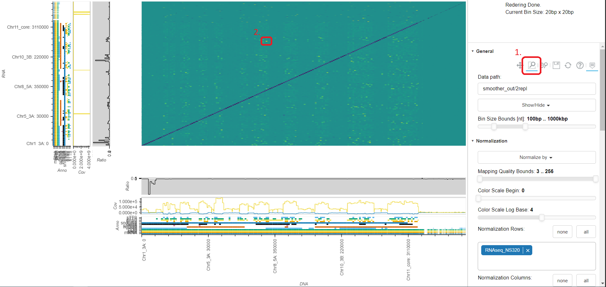

# Smoother Manual

Bulk of the manual

## Table of Contents

## Importing Data

### Preprocessing Data (_Anna_)

generating the chromosome lengths file
annotation file
bed & wig files
input formats
output all alignments
provide some sample files

### Create Index (_Anna_)

creating an empty index
adding genome sizes
and annotation file
min bin size parameter

### Adding Replicates (_Anna_)

adding hi-c or radicl-seq replicates

### Adding Normalization Tracks (_Anna_)

adding read or wig normalization tracks

### Adding Grid-seq normalizations (@todo better name) (_Markus_)

creating relevant plots (infliction point)
setting parameters
adding as normalization track

## Viewing Data

### Example Experiments (_Anna_)

#### Example Analysis No. 1 - Markus Departmental

The purpose of this analysis is simply to show some of the features of smoother.

First, we open smoother with one of the sample datasets: 
2 replicates of Anna's data - protein mediated and non-protein mediated RNA-DNA interactions (RADICL-seq).

    For this we open the viewer and type test in General->Data path

The grey lines we see show the borders between contigs.
Our organism is *Trypanosoma Brucei*, which has a lot of minichromosomes - 
these are partially assembled as a lot of small unitigs at the end of the genome.
Since they are so small they show up as a solid grey area to the top-right of the middle plot.

    We remove the grey lines by clicking on General->Show/Hide->Grid Lines.

Next, the size of bins is too large to see anything.

    We go to Interface->Number of Bins and increase the slider.

Next, we want to pick our normalization technique as currently we are looking at un-normalized data.

    We click on Normalization->Normalize by->Row Sum, to normalize the sum of each row to 1

*T. brucei's* genome has a lot of repetitive regions, especially at the telomeres.
Currently all found contact points are rendered;
however, for repetitive regions it is often impossible to map a read to a unique genomic loci.
In such cases mappers will still map the read to one possible genomic loci, but mark the read with a low confidence (i.e. Mapping Quality) value.
These low confidence reads produce a lot of noise.

    We now filter out such low confidence reads by moving the lower bound of the Filters->Mapping Quality Bounds slider from 0 to 3.

Finally, we have 2 replicates loaded.
Currently, they are simply added together after normalization.
We would like to display the differences between them though.

    Hence, we click on Replicates->Between Group->Substract.

We now see a log of differences between the two datasets.
first, we would like to focus on the most striking differences.
For this, we change color scale so that we se more differences between larger number but less between smaller numbers.

    We move the Normalization->Color Scale Log Base slider from 10 to 4.

Now let's inspect onf of the most striking interactions by zooming in.

    For this we click on General->Zoom (the magnifying glass in the toolbar at the top) and drag a rectangle around the interaction we want to inspect further.

    Then, we hover over the interaction.

### List of Plots and what they show (_Anna_)

the heatmap the ratio & coverage plots 
mention hovers
also include status text & command line output

### List of Buttons and their functionality (_Both_)

top to bottom list of things
group by category
don't forget the bokeh buttons

#### Normalization (_Markus_)

##### Normalize by

Smoother can normalize data in various ways. Some of them are suited for symmetric data (e.g. Hi-C), some for asymmetric data (e.g. RADICL-seq).
For some normalizations, views or different regions or with different bin sizes are not comparable.
Note that for these normalizations, even zooming or moving around may skew the displayed values.
It is recommended to use these normalizations merely as an exploratory tool but never to compare e.g. two screenshots of different regions.

| Name | Picture | Description | For Symm. | For Asymm. | Always Comparable |
|-|-|-|-|-|-|
| Largest Rendered Bin | | Divide the number of interactions in each bin the number of interactions in the largest rendered bin. This keeps differences between bins nicely visible by always ensuring that the colorscale is used fully. | ✔️ | ✔️ | |
| Reads per Million | | Divide the number of interactions in each bin by the number of million reads in the dataset. | ✔️ | ✔️ | ✔️ |
| Reads per Thousand | | Divide the number of interactions in each bin by the number of thousand reads in the dataset. | ✔️ | ✔️ | ✔️ |
| Column Sum | | Divide the number of interactions in each bin by the number of interactions in the complete column that bin belongs to. | | ✔️ | ✔️ |
| Row Sum | | Divide the number of interactions in each bin by the number of interactions in the complete row that bin belongs to. | | ✔️ | ✔️ |
| Coverage of Normalization Reads (Absolute) | | Divide the number of interactions in each bin by the coverage of the normalization datasets. With the 'Normalization Rows' and 'Normalization Columns' pickers, you can decide what datasets should be used for the columns and rows. | ✔️ | ✔️ | ✔️ |
| Coverage of Normalization Reads (Scaled) | | Same as the absolute version, but makes sure the complete colorscale is used. | ✔️ | ✔️ | |
| Binominal Test | | Use a binominal test to determine weather each bin is statistically significant, in it's row. This strategy was created by Bonetti et al. for RADICL-seq RNA-DNA interaction data [3]. The acceptance p-value can be modified with a slider. \*For views that do not show the entire genome, we use an approximation for the p-value adjustment that is performed after the binominal test. | | ✔️ | ✔️* |
| Iterative Correction | | Use the iterative correction approach developed for Hi-C data by Imakaev et al. [4]. @todo this is ICE correct? | ✔️ | | ✔️ |

Since smoother is capable of normalizing data on the fly, you can zoom in to a region of interest and then dynamically change the normalization strategy.

Groups A and B are normalized individually and then combined according to the 'Between Group' setting (see Replicates section).
The 'In Group' operation (see Replicates section) is applied before the Normalization.

##### Color Scale Begin \& Color Scale Log Base

After normalization, the values in each bin are between zero and one. 
Before displaying these values in the heatmap, we apply a logarithmic transformation.
Like with logarithmic scales, this keeps all values in the same order but this makes a difference between two small numbers appear bigger than the same difference between two bigger numbers.
You can fiddle with the strength of this effect using the 'Color Scale Log Base' slider.
In brief, higher values for the log base increase the difference between small numbers but make larger number look more similar.
Lower values do the opposite.
Setting log base to zero displays the numbers without any transformation.

Additionally, the 'color scale begin' slider can be used to cut off the bottom of the color scale, i.e. to only show bins with more than x interactions. 
This option subtracts from the raw number of interactions; it is applied before normalization and application of the log scale.

In detail, the function we use is:

, where *x* and *y* are the un-normalized and normalized interaction frequencies while *a* is the log base parameter.
With varying values for *a*, this function always satisfies *f(0)=0* and *f(1)=1*.
for *a=0* the function is undefined but approaches the 45-degree diagonal, so we hardcode *f(x)=x* for *a=0*.

#### Quick Config Buttons

what do they change

## Using Slurm (_Markus_)

smoother can run within slurm 

## Installing via GitHub (_Markus_)

getting the current development version

## Setting up a Webserver (_Markus_)

smoother can be deployed as a webserver so this should be described

## The Datastructure (_Markus_)

link to datastructure github

### Brief Algorithmic Description

### Fileformat specification

what files
how are they encoded (link to libSps)

### Implementation Details

some runtime details

## Citing Smoother

## References

[1] Shekelyan, M., Dignös, A. & Gamper, J. Sparse prefix sums: Constant-time range sum queries over sparse multidimensional data cubes. Information Systems 82, 136–147 (2019).

[2] Schmidt et al. @todo

[3] Bonetti, A. et al. RADICL-seq identifies general and cell type–specific principles of genome-wide RNA-chromatin interactions. Nat Commun 11, 1018 (2020).

[4] Imakaev, M. et al. Iterative correction of Hi-C data reveals hallmarks of chromosome organization. Nat Methods 9, 999–1003 (2012).

## Thanks to...
- Bokeh
- Stxxl
- Sparse Prefix Sums paper
- Papers with the normalizations
- Dataset origin